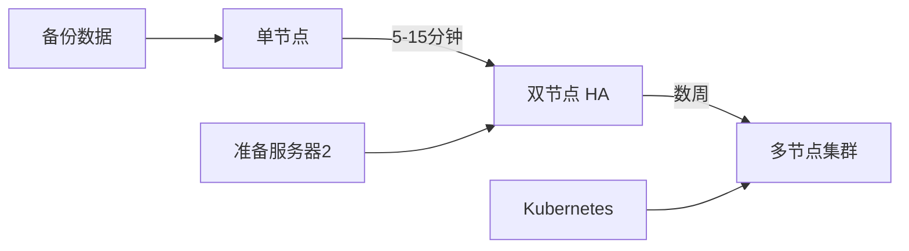

# 部署方案选择指南

> 为您的 IDP-CMS 新闻网站选择最适合的部署方案

## 🎯 三种部署方案对比

### 方案 1: 单节点部署（推荐起步）⭐

**适用场景**：
- ✅ 初期上线，验证业务模型
- ✅ 预算有限，单服务器运行
- ✅ 流量较小（< 1000 并发）
- ✅ 可接受短暂维护停机

**架构图**：
```
     用户
      │
      ▼
 ┌──────────┐
 │ 服务器1   │
 │ 所有服务  │
 └──────────┘
```

**优势**：
- 💰 成本低（单服务器）
- 🚀 部署快（15分钟）
- 🔧 维护简单
- ⏫ 可平滑升级到 HA

**劣势**：
- ⚠️ 单点故障风险
- ⚠️ 维护需要停机
- ⚠️ 性能受限于单机

**部署指南**：[SINGLE_NODE_DEPLOYMENT.md](./SINGLE_NODE_DEPLOYMENT.md)

**快速部署**：
```bash
./deploy/scripts/deploy-node1-standalone.sh
```

---

### 方案 2: 双节点高可用（推荐生产）⭐⭐⭐

**适用场景**：
- ✅ 正式生产环境
- ✅ 不能接受服务中断
- ✅ 流量较大（> 1000 并发）
- ✅ 需要负载均衡

**架构图**：
```
        用户
         │
         ▼
    ┌─────────┐
    │ 负载均衡 │
    └────┬────┘
         │
    ┌────┴────┐
    │         │
    ▼         ▼
┌────────┐ ┌────────┐
│服务器1  │ │服务器2  │
│(主节点) │ │(从节点) │
└────┬───┘ └───┬────┘
     │         │
     └────┬────┘
          │
    ┌─────▼─────┐
    │ 主从复制   │
    │ 数据同步   │
    └───────────┘
```

**优势**：
- ✅ 高可用（自动故障转移）
- ✅ 负载均衡（性能翻倍）
- ✅ 零停机维护
- ✅ 数据实时备份

**劣势**：
- 💰 成本高（双服务器）
- 🔧 配置复杂
- 📊 需要监控管理

**部署方式**：

**方式A：直接部署双节点**
```bash
./deploy-all-from-local.sh
```

**方式B：从单节点升级**（推荐）
```bash
# 1. 先部署单节点
./deploy/scripts/deploy-node1-standalone.sh

# 2. 未来升级到 HA（5-15分钟）
./deploy/scripts/upgrade-to-ha.sh
```

**升级指南**：[HA_UPGRADE_GUIDE.md](./HA_UPGRADE_GUIDE.md)

---

### 方案 3: 多节点集群（企业级）⭐⭐⭐⭐⭐

**适用场景**：
- ✅ 超大流量（> 10000 并发）
- ✅ 多地域部署
- ✅ 极高可用性要求
- ✅ 企业级预算

**架构图**：
```
              用户
               │
        ┌──────┴──────┐
        │   CDN/WAF   │
        └──────┬──────┘
               │
        ┌──────▼──────┐
        │  云负载均衡  │
        └──────┬──────┘
               │
    ┌──────────┼──────────┐
    │          │          │
    ▼          ▼          ▼
┌───────┐  ┌───────┐  ┌───────┐
│ 节点1  │  │ 节点2  │  │ 节点N  │
└───┬───┘  └───┬───┘  └───┬───┘
    │          │          │
    └──────────┼──────────┘
               │
        ┌──────▼──────┐
        │  数据库集群 │
        │  (主从+分片) │
        └─────────────┘
```

**特性**：
- 🌍 多地域部署
- 📈 无限横向扩展
- 🔒 多重容灾
- 📊 完整监控体系

**实施建议**：
- 从方案2开始
- 逐步扩展节点
- 考虑 Kubernetes
- 引入专业 DevOps 团队

---

## 📊 方案对比表

| 特性 | 单节点 | 双节点 HA | 多节点集群 |
|------|--------|-----------|-----------|
| **部署时间** | 15分钟 | 30分钟 | 1-2天 |
| **并发能力** | ~1000 | ~5000 | 10000+ |
| **可用性** | 95% | 99.9% | 99.99% |
| **成本** | ¥500/月 | ¥1000/月 | ¥5000+/月 |
| **维护难度** | ⭐ | ⭐⭐⭐ | ⭐⭐⭐⭐⭐ |
| **升级路径** | ✅ 可升级 | ✅ 可扩展 | - |

## 🚀 推荐部署路径

### 阶段 1: 启动期（0-3个月）

**推荐：单节点部署**

```bash
# 服务器配置: 4核8G
# 预计成本: ¥500/月

1. 部署单节点
   ./deploy/scripts/deploy-node1-standalone.sh

2. 配置域名和 SSL
   sudo certbot --nginx -d yourdomain.com

3. 设置自动备份
   crontab -e
   # 添加每日备份任务
```

**关键指标**：
- 日访问量 < 10万
- 并发用户 < 1000
- 响应时间 < 500ms

---

### 阶段 2: 成长期（3-12个月）

**推荐：升级到双节点 HA**

**触发条件**（满足任一即升级）：
- ⚠️ 流量持续超过单节点 70% 负载
- ⚠️ 频繁出现性能瓶颈
- ⚠️ 业务要求零停机维护
- ✅ 预算允许增加服务器

**升级步骤**：
```bash
# 1. 准备第二台服务器
#    IP: 121.41.73.49
#    配置: 4核8G

# 2. 执行升级（预计停机 5-15分钟）
./deploy/scripts/upgrade-to-ha.sh

# 3. 配置负载均衡器
./deploy/scripts/setup-load-balancer.sh

# 4. 验证高可用
./deploy/scripts/health-check-ha.sh
```

**关键指标**：
- 日访问量 10万-100万
- 并发用户 1000-5000
- 可用性 > 99.9%

---

### 阶段 3: 扩展期（1年+）

**推荐：多节点集群**

**考虑条件**：
- 日访问量 > 100万
- 需要多地域部署
- 需要微服务架构
- 企业级预算

**技术栈升级**：
- Kubernetes 容器编排
- 数据库读写分离 + 分片
- Redis 集群模式
- 消息队列（RabbitMQ/Kafka）
- 服务网格（Istio）

---

## 💡 决策建议

### 如果您是...

**初创团队 / 个人开发者**：
- ✅ 选择：单节点部署
- 📖 文档：[SINGLE_NODE_DEPLOYMENT.md](./SINGLE_NODE_DEPLOYMENT.md)
- 💰 成本：~¥500/月
- ⏱️ 部署：15分钟

**中小企业 / 正式上线**：
- ✅ 选择：双节点 HA（从单节点升级）
- 📖 文档：[HA_UPGRADE_GUIDE.md](./HA_UPGRADE_GUIDE.md)
- 💰 成本：~¥1000/月
- ⏱️ 升级：5-15分钟

**大型企业 / 高流量网站**：
- ✅ 选择：多节点集群
- 📖 文档：联系技术顾问
- 💰 成本：定制方案
- ⏱️ 部署：1-2周

---

## 📚 相关文档

### 部署指南
- [单节点部署指南](./SINGLE_NODE_DEPLOYMENT.md) - 快速上线
- [HA 升级指南](./HA_UPGRADE_GUIDE.md) - 平滑升级
- [一键部署说明](./DEPLOY_ALL_README.md) - 直接部署 HA

### 运维文档
- [运维手册](./docs/guides/HA_OPERATIONS.md) - 日常运维
- [故障排查](./docs/guides/HA_TROUBLESHOOTING.md) - 问题解决
- [监控指南](./docs/guides/MONITORING_GUIDE.md) - 监控配置

### 快速命令
- [命令速查表](./QUICK_COMMANDS.md) - 常用命令

---

## 🔄 迁移路径

### 从单节点迁移到 HA



**步骤概览**：
1. ✅ 在服务器1运行单节点（随时）
2. ✅ 准备服务器2（未来）
3. ✅ 执行升级脚本（5-15分钟）
4. ✅ 配置负载均衡（10分钟）
5. ✅ 验证高可用（5分钟）

**总时间**：~30分钟完成升级！

---

## ❓ 常见问题

### Q1: 我应该选择哪个方案？

**A**: 根据以下因素决定：
- 预算 < ¥1000/月 → 单节点
- 预算 ≥ ¥1000/月 + 需要高可用 → 双节点 HA
- 大流量 + 企业级 → 多节点集群

### Q2: 单节点升级到 HA 需要停机吗？

**A**: 需要短暂停机（5-15分钟）用于：
- 配置 PostgreSQL 主从复制
- 启用 Redis Sentinel
- 切换到负载均衡器

### Q3: 升级到 HA 后能回滚吗？

**A**: 可以！我们提供完整的回滚方案：
```bash
# 停止服务器2
ssh root@121.41.73.49 "docker-compose down"

# 恢复服务器1单节点模式
docker-compose -f infra/production/docker-compose-ha-node1.yml down
docker-compose -f infra/production/docker-compose-ha-node1.yml up -d
```

### Q4: 数据会丢失吗？

**A**: 不会！升级过程中：
- ✅ 自动备份所有数据
- ✅ PostgreSQL 主从实时同步
- ✅ 可随时回滚到备份点

### Q5: 需要修改应用代码吗？

**A**: 不需要！所有高可用配置在基础设施层完成：
- 应用代码无需修改
- 只需调整环境变量
- 数据库连接自动处理

---

## 🆘 获取帮助

### 技术支持

- 📧 Email: support@idp.xyz
- 💬 Issues: [GitHub Issues](https://github.com/idpxyz/idp-cms/issues)
- 📖 文档: [完整文档目录](./docs/)

### 快速链接

```bash
# 单节点部署
./deploy/scripts/deploy-node1-standalone.sh

# HA 升级
./deploy/scripts/upgrade-to-ha.sh

# 一键 HA 部署
./deploy-all-from-local.sh

# 健康检查
./deploy/scripts/health-check-ha.sh
```

---

**选择适合您的方案，开始部署吧！** 🚀

