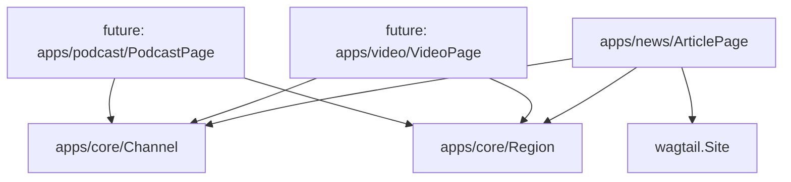

## 🏗️ 模型分层设计的逻辑解释

### 📁 当前模型分布：

```
apps/core/models.py:
├── Channel      # 频道模型
├── Region       # 地区模型
└── SiteSettings # 站点配置

apps/news/models/article.py:
└── ArticlePage  # 文章模型
```

### 🎯 **设计原理：领域驱动设计 (DDD)**

#### **1. `core` - 核心领域层**

```python
# 基础设施模型 - 被多个业务域复用
Channel   # 所有内容类型都可能需要频道分类
Region    # 所有内容类型都可能需要地区分类
SiteSettings # 站点级别的全局配置
```

**特点**：

- ✅ **无业务依赖** - 不依赖具体业务逻辑
- ✅ **高复用性** - 可被多个 app 使用
- ✅ **稳定性** - 变更频率低，接口稳定

#### **2. `news` - 新闻业务层**

```python
# 新闻领域特有模型
ArticlePage  # 新闻文章的具体实现
```

**特点**：

- ✅ **业务专属** - 只服务于新闻内容管理
- ✅ **依赖核心层** - FK 指向 Channel/Region
- ✅ **业务复杂** - 包含丰富的新闻特定字段

### 🔄 **依赖关系图**：



### 💡 **为什么这样设计？**

#### **优势 1：可扩展性**

```python
# 未来添加新内容类型时：
apps/video/models.py:
    class VideoPage(Page):
        channel = FK(Channel)  # 复用core层
        region = FK(Region)    # 复用core层

apps/podcast/models.py:
    class PodcastPage(Page):
        channel = FK(Channel)  # 复用core层
        region = FK(Region)    # 复用core层
```

#### **优势 2：职责清晰**

- **core** 负责：基础数据结构、站点配置、通用工具
- **news** 负责：新闻内容管理、编辑流程、发布策略

#### **优势 3：团队协作**

- **基础设施团队** 维护 `core`
- **内容团队** 维护 `news`
- **产品团队** 可独立扩展新的内容类型

### 🏆 **行业最佳实践对比**：

#### **Django 官方推荐**：

```
# Django项目结构
myproject/
├── accounts/     # 用户认证（核心）
├── blog/         # 博客业务
├── shop/         # 商城业务
└── core/         # 共享组件
```

#### **Wagtail CMS 标准**：

```
# Wagtail项目结构
cms/
├── core/         # 基础模型和配置
├── blog/         # 博客页面类型
├── events/       # 事件页面类型
└── products/     # 产品页面类型
```

### ✅ **结论**：

这是**标准的 Django/Wagtail 项目架构**！

1. **符合单一职责原则** - 每个 app 专注自己的领域
2. **遵循依赖倒置** - 业务层依赖核心层，不反向依赖
3. **支持水平扩展** - 新内容类型可轻松添加
4. **便于团队维护** - 职责边界清晰

这种设计让系统既**稳定又灵活**，是企业级 CMS 的成熟架构模式！🎯
