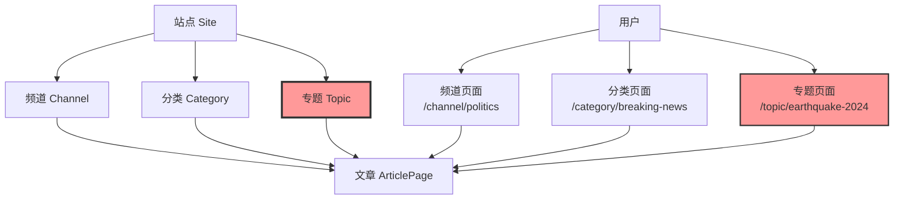
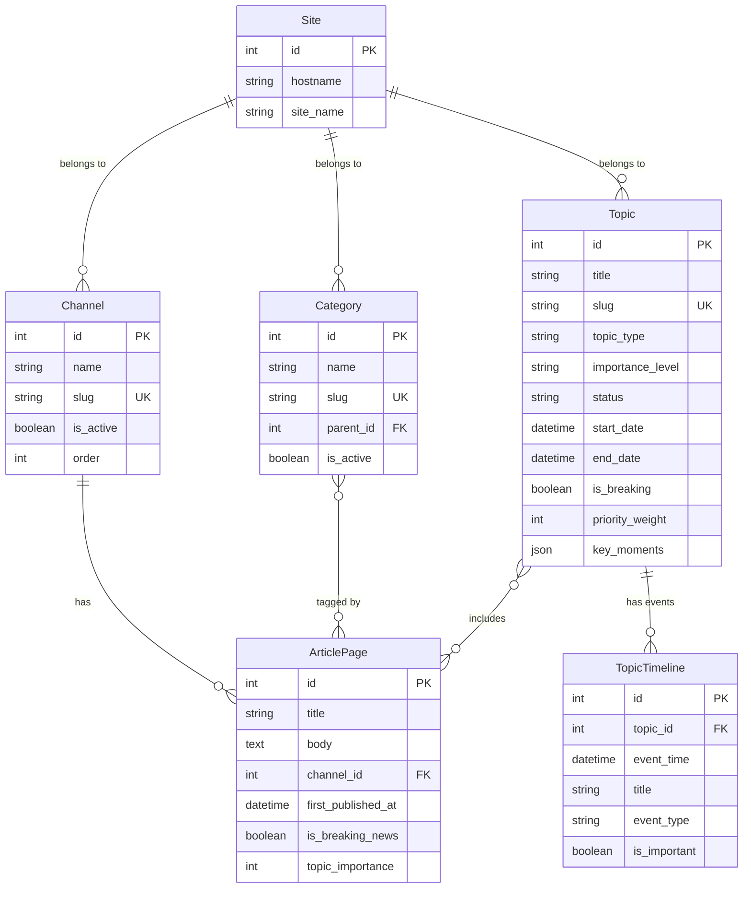
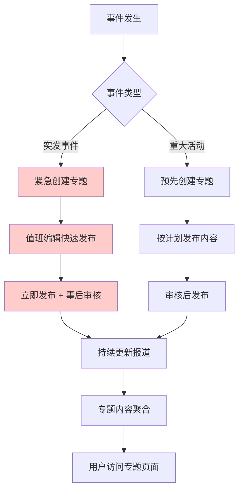
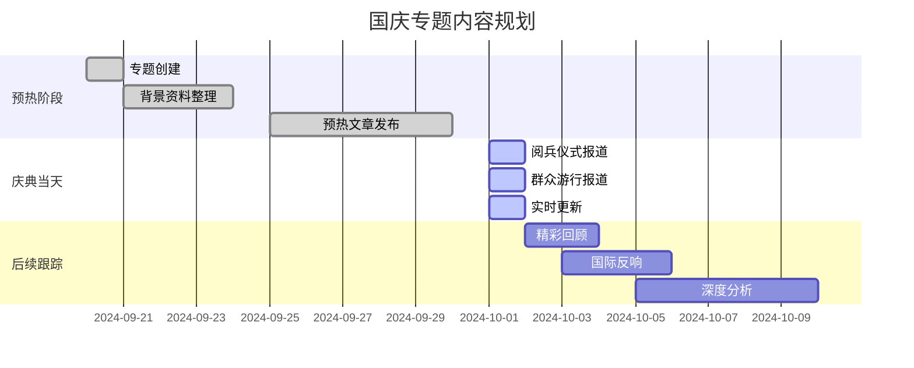
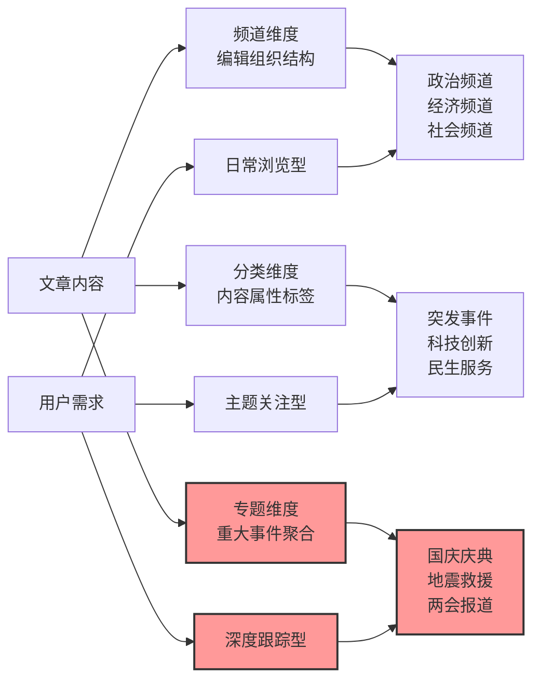

# 党报头条 - 专题系统定义文档

## 📋 概述

**专题系统**是党报头条平台针对重大事件、重要活动的深度报道聚合系统，专注于**国家级重大事件**和**具有重要社会影响力事件**的全方位、持续性跟踪报道。

### 核心定位
```
专题 ≠ 日常热门新闻推荐
专题 = 重大事件的权威信息聚合平台
```

## 🎯 专题定义

### 什么是专题

**专题（Topic）**是围绕特定重大事件或重要主题，将相关新闻报道、官方信息、深度分析进行**系统性整理和持续性跟踪**的内容聚合形式。

#### 核心特征
- **重大性**: 具有国家级或重大社会影响力
- **系统性**: 全方位、多角度的完整报道
- **持续性**: 跨时间维度的动态跟踪
- **权威性**: 官方信息与媒体报道并重
- **专题性**: 围绕单一主题的深度聚合

### 专题与现有系统的关系

#### 系统架构关系图



#### 三维内容组织体系

| 维度 | 定位 | 典型示例 | 关联关系 | 更新特点 |
|------|------|----------|----------|----------|
| **频道 Channel** | 编辑组织结构 | 政治、经济、社会 | 一对多（一篇文章属于一个频道） | 持续更新，无结束时间 |
| **分类 Category** | 内容属性标签 | 科技创新、民生服务 | 多对多（一篇文章可有多个分类） | 持续使用，标签性质 |
| **专题 Topic** | 重大事件聚合 | 国庆庆典、地震救援 | 多对多（一篇文章可属于多个专题） | 事件驱动，有生命周期 |

#### 文章的多重归属示例

```python
# 突发地震新闻的归属
article = ArticlePage(
    title="四川6.8级地震最新消息",
    channel="社会频道",              # 单一频道（编辑组织）
    categories=["突发事件", "自然灾害"],   # 多个分类（内容标签）
    topics=["四川地震救援专题"]        # 关联专题（事件聚合）
)

# 国庆阅兵报道的归属
article = ArticlePage(
    title="2024年国庆阅兵精彩回顾",
    channel="政治频道",              # 单一频道
    categories=["国内政治", "军事装备"],   # 多个分类
    topics=["2024国庆节庆典专题"]      # 关联专题
)
```

#### 用户访问路径对比

```
同一篇地震新闻，用户可通过不同路径访问：

/channel/society     → 社会频道的日常新闻（包括地震新闻）
/category/breaking   → 所有突发事件新闻（跨频道聚合）
/topic/earthquake    → 地震事件的完整报道（深度跟踪）

每个路径满足不同的用户需求：
频道 = "我想看社会新闻"        （日常浏览）
分类 = "我想看突发事件"        （主题关注）  
专题 = "我想了解地震全貌"      （深度跟踪）
```

### 典型专题示例

#### 🎊 国家庆典类
- **国庆节庆典** - 阅兵式、庆祝活动、民众反响
- **建党周年** - 纪念活动、历史回顾、成就展示
- **国家重大纪念日** - 抗战胜利日、建军节等

#### 📢 政治事件类  
- **全国两会** - 会议议程、重要提案、代表访谈
- **党代会** - 会议报告、选举结果、政策解读
- **重要国事访问** - 访问日程、会谈成果、国际反响

#### 🚨 突发事件类
- **重大自然灾害** - 地震、洪灾的救援进展和灾后重建
- **重大安全事故** - 事故处理、调查结果、责任追究
- **重大公共卫生事件** - 疫情防控、医疗救治、政策措施

#### 🏆 重大活动类
- **奥运会、亚运会** - 赛事进展、中国队表现、赛事花絮
- **重大科技成就** - 载人航天、重大工程、科技突破
- **重要国际会议** - G20峰会、一带一路论坛等

## 📊 专题分类体系

### 按重要程度分类

| 级别 | 定义 | 典型示例 | 处理优先级 |
|------|------|----------|------------|
| **国家级** | 具有全国性重大影响 | 国庆阅兵、两会、重大灾害 | 最高优先级 |
| **重大级** | 具有重要社会影响 | 省级重大事件、重要节日 | 高优先级 |
| **区域级** | 具有区域性影响 | 地市级重大事件 | 中等优先级 |
| **专门级** | 特定领域重要事件 | 行业重大事件、专业领域 | 按需处理 |

### 按事件类型分类

| 类型 | 图标 | 说明 | 典型周期 |
|------|------|------|----------|
| **国家庆典** | 🎊 | 国庆、建党等重大庆典 | 年度/特殊年份 |
| **政治事件** | 🏛️ | 两会、党代会、重要会议 | 定期/不定期 |
| **突发事件** | 🚨 | 自然灾害、安全事故 | 突发性 |
| **重大活动** | 📢 | 奥运会、世博会、论坛 | 不定期 |
| **纪念活动** | 🕯️ | 重要纪念日、追思活动 | 年度 |
| **科技成就** | 🚀 | 航天发射、重大突破 | 不定期 |
| **国际事务** | 🌍 | 外交访问、国际会议 | 不定期 |
| **救灾救援** | 🆘 | 灾害救援、紧急救助 | 应急性 |

### 按状态分类

| 状态 | 说明 | 展示特点 |
|------|------|----------|
| **即将开始** | 预告阶段，事件尚未发生 | 倒计时、预热报道 |
| **正在进行** | 事件进行中，实时跟踪 | 实时更新、动态报道 |
| **刚刚结束** | 事件结束，仍有关注度 | 总结报道、后续影响 |
| **纪念回顾** | 重要事件的周年纪念 | 历史回顾、纪念文章 |
| **已归档** | 完全结束，归档保存 | 历史查阅、资料保存 |

## 🔧 核心功能特性

### 1. 生命周期管理

#### 专题创建
- **预创建**: 重大事件预告期提前创建专题
- **快速创建**: 突发事件快速响应创建
- **模板创建**: 基于历史专题模板快速创建

#### 动态跟踪
- **实时更新**: 事件进展的实时内容更新
- **阶段管理**: 事件不同阶段的内容组织
- **关键节点**: 重要时间点和里程碑标记

#### 专题归档
- **自动归档**: 根据时间和状态自动归档
- **历史保存**: 重要专题的永久保存
- **检索优化**: 归档专题的搜索和查阅

### 2. 内容聚合机制

#### 多源聚合
```
官方信息 + 媒体报道 + 现场报道 + 专家分析 + 民众反响
```

#### 智能去重
- **跨平台去重**: 避免与Headlines、Hot News重复
- **内容去重**: 相同信息的智能合并
- **来源标识**: 不同来源的清晰标记

#### 优先级排序
```python
专题内容优先级 = 权威性权重 × 时效性权重 × 相关性权重
```

### 3. 展示方式

#### 专题首页
- **横幅展示**: 突发重大事件的醒目横幅
- **时间轴**: 事件发展的时间脉络
- **分类展示**: 不同类型内容的分区展示

#### 专题详情页
- **完整报道**: 事件的全方位报道聚合
- **官方信息**: 权威机构的官方发布
- **媒体观察**: 各媒体的分析评论
- **民众声音**: 社会各界的反响

#### 移动端适配
- **响应式布局**: 适配不同屏幕尺寸
- **快速加载**: 移动端优化加载速度
- **触摸友好**: 手势操作和交互优化

## 🚫 与现有系统的边界

### Headlines vs 专题

| 维度 | Headlines | 专题系统 |
|------|-----------|----------|
| **内容粒度** | 单篇优质文章 | 主题化内容集合 |
| **时效性** | 24小时热度 | 事件全生命周期 |
| **更新频率** | 小时级更新 | 事件驱动更新 |
| **用户价值** | 快速了解要闻 | 深度跟踪事件 |
| **典型场景** | 日常浏览 | 重大事件关注 |

### Hot News vs 专题

| 维度 | Hot News | 专题系统 |
|------|----------|----------|
| **关注焦点** | 突发热点 | 重大事件 |
| **内容深度** | 快速报道 | 深度聚合 |
| **持续时间** | 分钟到小时 | 天到月 |
| **信息来源** | 多源快速 | 权威深度 |
| **典型场景** | 追踪热点 | 系统了解 |

### 功能协同机制

```
突发事件发生
↓
Hot News 立即推送快讯
↓
Headlines 聚合相关报道  
↓
专题系统 创建深度专题
↓
持续跟踪事件发展
```

## 🛠️ 技术实现要点

### 专题模板系统设计

参考Channel模板系统的成功经验，Topic系统将采用相同的模板机制：

```python
# 专题模板系统（参考Channel模板设计）
class TopicTemplate(ClusterableModel):
    """专题模板管理 - 类似ChannelTemplate"""
    name = models.CharField(max_length=100, verbose_name="模板名称")
    slug = models.SlugField(unique=True, verbose_name="模板标识")
    file_name = models.CharField(max_length=100, verbose_name="模板文件名")  # 如：BreakingTopicTemplate.tsx
    is_active = models.BooleanField(default=True, verbose_name="是否启用")
    is_default = models.BooleanField(default=False, verbose_name="是否为默认模板")

# Topic模型增加模板字段
class Topic(ClusterableModel):
    # 现有字段...
    template = models.ForeignKey(
        'TopicTemplate', 
        on_delete=models.SET_NULL,
        null=True, blank=True,
        verbose_name="专题模板"
    )
```

#### 专题模板类型
- **DefaultTopicTemplate** - 默认专题模板，适合一般专题
- **BreakingTopicTemplate** - 突发重大事件模板，红色主题，动态效果
- **NationalTopicTemplate** - 国家级专题模板，庄重正式风格
- **TimelineTopicTemplate** - 时间线型专题模板，突出事件发展轨迹

### 数据模型设计

#### 核心模型关系图



#### 专题数据模型详细设计

```python
class Topic(ClusterableModel):
    """重大事件专题模型 - 专注于国庆、阅兵、地震等重大事件"""
    
    # === 基本信息 ===
    title = models.CharField(max_length=128, verbose_name="专题标题")
    slug = models.SlugField(unique=True, verbose_name="专题标识") 
    summary = models.TextField(blank=True, verbose_name="专题摘要")
    
    # === 专题分类 ===
    # 注意：专题分类通过灵活的标签系统实现，不使用固定的类型字段
    # 管理员可以通过标签灵活定义：国庆庆典、突发灾害、体育赛事、政治事件等
    
    IMPORTANCE_LEVELS = [
        ('national', '国家级'),      # 国庆、阅兵等
        ('major', '重大级'),         # 省级重大事件
        ('regional', '区域级'),      # 地市级事件
        ('local', '本地级'),         # 县区级事件
    ]
    importance_level = models.CharField(max_length=16, choices=IMPORTANCE_LEVELS)
    
    STATUS_CHOICES = [
        ('upcoming', '即将开始'),     # 预告阶段
        ('ongoing', '正在进行'),      # 进行中
        ('concluded', '已结束'),      # 结束但仍关注
        ('archived', '已归档'),       # 完全结束
        ('memorial', '纪念回顾'),     # 周年纪念等
    ]
    status = models.CharField(max_length=16, choices=STATUS_CHOICES)
    
    # === 时间管理 ===
    start_date = models.DateTimeField(null=True, blank=True, verbose_name="事件开始时间")
    end_date = models.DateTimeField(null=True, blank=True, verbose_name="事件结束时间")
    key_moments = models.JSONField(default=list, blank=True, verbose_name="关键时间点",
        help_text="存储事件的关键时间节点，如阅兵的不同环节时间")
    
    # === 控制字段 ===
    is_active = models.BooleanField(default=True, verbose_name="是否启用")
    is_featured = models.BooleanField(default=False, verbose_name="是否推荐")
    is_breaking = models.BooleanField(default=False, verbose_name="是否突发重大事件")
    priority_weight = models.IntegerField(default=100, verbose_name="优先权重",
        help_text="数值越大优先级越高，重大事件如地震可设置为1000")
    
    # === 关联信息 ===
    sites = models.ManyToManyField('wagtailcore.Site', blank=True, verbose_name="关联站点")
    related_departments = models.TextField(blank=True, verbose_name="相关部门",
        help_text="如：国防部、应急管理部、外交部等")
    official_links = models.JSONField(default=list, blank=True, verbose_name="官方链接",
        help_text="相关的官方网站、直播链接等")
    
    # === 时间戳 ===
    created_at = models.DateTimeField(auto_now_add=True, verbose_name="创建时间")
    updated_at = models.DateTimeField(auto_now=True, verbose_name="更新时间")
    
    class Meta:
        verbose_name = "重大事件专题"
        verbose_name_plural = "重大事件专题" 
        ordering = ['-is_breaking', '-priority_weight', '-is_featured', '-start_date']
        indexes = [
            models.Index(fields=['slug']),
            models.Index(fields=['topic_type', 'importance_level']),
            models.Index(fields=['status', 'is_active']),
            models.Index(fields=['-priority_weight', '-created_at']),
        ]


# 专题时间线模型
class TopicTimeline(models.Model):
    """专题时间线 - 记录事件发展过程"""
    
    topic = models.ForeignKey(Topic, on_delete=models.CASCADE, 
                             related_name='timeline_events', verbose_name="所属专题")
    event_time = models.DateTimeField(verbose_name="事件时间")
    title = models.CharField(max_length=200, verbose_name="事件标题")
    description = models.TextField(verbose_name="事件描述")
    
    EVENT_TYPES = [
        ('major', '重大进展'),
        ('update', '最新消息'),  
        ('official', '官方发布'),
        ('rescue', '救援行动'),
        ('ceremony', '仪式环节'),
    ]
    event_type = models.CharField(max_length=16, choices=EVENT_TYPES)
    is_important = models.BooleanField(default=False, verbose_name="是否重要节点")
    
    class Meta:
        ordering = ['-event_time']
        verbose_name = "专题时间线"


# 增强的文章模型（关系部分）
class ArticlePage(Page):
    # === 多重归属关系 ===
    
    # 单一频道归属（必选）
    channel = models.ForeignKey('core.Channel', null=True, blank=True,
                               on_delete=models.SET_NULL, related_name='articles',
                               verbose_name="频道", help_text="文章所属的编辑频道")
    
    # 多分类关联（可选，多选）
    categories = ParentalManyToManyField('core.Category', blank=True,
                                        related_name='articles', verbose_name="分类",
                                        help_text="选择文章所属的分类（可多选）")
    
    # 多专题关联（可选，多选）- 核心关系
    topics = ParentalManyToManyField('news.Topic', blank=True,
                                    related_name='articles', verbose_name="专题",
                                    help_text="选择文章所属的专题（可多选）")
    
    # === 专题相关字段 ===
    is_breaking_news = models.BooleanField(default=False, verbose_name="突发新闻",
                                          help_text="勾选后将优先显示在专题顶部")
    topic_importance = models.IntegerField(default=100, verbose_name="专题重要度",
                                          help_text="数值越高在专题中显示优先级越高")
    
    @property
    def topic_slug(self):
        """向后兼容属性：获取第一个专题的slug"""
        return self.topics.first().slug if self.topics.exists() else ''
```

### API接口设计

#### 专题列表接口
```
GET /api/topics/major-events
参数:
- type: 专题类型筛选
- status: 状态筛选  
- importance: 重要程度筛选
- limit: 返回数量限制
```

#### 专题详情接口
```
GET /api/topics/{slug}
返回:
- 专题基本信息
- 相关文章列表
- 时间轴数据
- 官方链接
```

### 缓存策略

```python
缓存层次:
L1: CDN缓存 (10分钟)
L2: 应用缓存 (5分钟) 
L3: 数据库缓存 (实时)

缓存失效:
- 专题内容更新时
- 新文章关联时
- 状态变更时
```

## 📝 运营管理指南

### 专题创建流程

#### 1. 重大事件预警
- **监控来源**: 官方通报、新闻发布、预定活动
- **评估标准**: 影响范围、关注度、持续时间
- **创建时机**: 事件发生前或发生时

#### 2. 专题策划
- **标题制定**: 准确、权威、易懂
- **分类确定**: 选择合适的专题类型
- **时间规划**: 设定专题的生命周期

#### 3. 内容组织  
- **官方信息**: 收集权威部门发布
- **媒体报道**: 筛选优质新闻报道
- **专家观点**: 邀请专家解读分析
- **现场报道**: 一线记者实地报道

### 专题文章发布机制

#### 文章发布工作流



#### 权限分级发布

| 事件类型 | 发布权限 | 审核流程 | 发布时效 |
|----------|----------|----------|----------|
| **突发重大事件** | 值班编辑 | 立即发布 → 事后审核 | 15分钟内 |
| **国家级重大活动** | 专题编辑 | 主编审核 → 发布 | 1小时内 |
| **区域性重要事件** | 一般编辑 | 专题编辑审核 → 发布 | 2小时内 |
| **深度分析报道** | 专题编辑 | 主编 + 法务审核 → 发布 | 1天内 |

#### 多重归属发布示例

```python
# 地震突发事件的发布流程
def publish_earthquake_article():
    # 1. 创建文章
    article = ArticlePage.objects.create(
        title="四川6.8级地震最新消息",
        body="地震发生的详细报道内容...",
        author_name="现场记者张三",
        
        # 多重归属
        channel=Channel.objects.get(slug='society'),  # 社会频道
        is_breaking_news=True,                        # 突发新闻标识
        topic_importance=1000                         # 最高优先级
    )
    
    # 2. 关联分类
    article.categories.add(
        Category.objects.get(slug='breaking-news'),   # 突发事件
        Category.objects.get(slug='natural-disaster')  # 自然灾害
    )
    
    # 3. 关联专题
    topic = Topic.objects.get(slug='sichuan-earthquake-2024')
    article.topics.add(topic)
    
    # 4. 立即发布（突发事件绿色通道）
    article.save_revision().publish()
    
    # 5. 更新专题状态
    topic.is_breaking = True
    topic.status = 'ongoing'  
    topic.save()
    
    return article

# 用户访问路径
访问路径1: /channel/society → 看到社会频道最新文章（包括地震新闻）
访问路径2: /category/breaking-news → 看到所有突发事件（跨频道聚合）  
访问路径3: /topic/sichuan-earthquake-2024 → 看到地震专题完整报道
```

### 内容更新规范

#### 突发事件专题
- **首报**: 事件发生后30分钟内
- **续报**: 每2小时更新进展
- **深度**: 每日发布深度分析
- **总结**: 事件结束后全面总结

#### 重大活动专题
- **预热**: 活动前1周开始预热
- **实况**: 活动期间实时更新  
- **回顾**: 活动结束后深度回顾
- **影响**: 跟踪后续影响分析

### 质量控制标准

#### 信息准确性
- **来源核实**: 确保信息来源可靠
- **多方验证**: 重要信息多方确认
- **及时更正**: 错误信息及时更正
- **权威优先**: 优先采用官方信息

#### 内容完整性
- **全面覆盖**: 事件各个方面都有涉及
- **逻辑清晰**: 内容组织逻辑合理
- **时序明确**: 时间脉络清楚明确
- **重点突出**: 关键信息醒目展示

## 📈 效果评估

### 关键指标

#### 用户参与度
- **专题访问量**: 单个专题的总访问次数
- **用户停留时间**: 平均页面停留时长
- **深度阅读率**: 完整阅读专题内容的比例
- **分享传播数**: 专题内容的分享次数

#### 内容质量度
- **内容丰富度**: 专题内文章数量和质量
- **更新及时性**: 重要信息的更新速度
- **信息准确性**: 内容的准确性和权威性
- **用户满意度**: 用户反馈和评价

#### 社会影响力
- **媒体引用**: 其他媒体的引用转载
- **社交传播**: 社交媒体的讨论热度
- **权威认可**: 官方机构的认可引用
- **专业评价**: 业内专家的专业评价

### 优化方向

#### 技术优化
- **加载速度**: 提升页面加载性能
- **移动体验**: 优化移动端用户体验
- **搜索功能**: 增强专题内容搜索
- **个性化**: 基于用户兴趣的个性化推荐

#### 内容优化  
- **多媒体**: 增加视频、图片、互动内容
- **可视化**: 数据可视化和信息图表
- **互动性**: 增加用户评论和讨论功能
- **国际化**: 重大事件的多语言版本

## 📚 最佳实践案例

### 完整案例分析

#### 案例1：2024年四川地震救援专题

**事件背景**: 2024年某月某日，四川发生6.8级地震

```mermaid
timeline
    title 地震专题生命周期
    
    14:30 : 地震发生
    14:45 : 创建专题
          : 发布首条快讯
    15:00 : 关联社会频道
          : 添加突发事件分类
    16:00 : 发布救援进展
          : 官方通报
    18:00 : 专家解读
          : 现场报道
    次日  : 深度报道
          : 灾区现状
    一周后 : 重建计划
           : 专题归档
```

**多维度内容组织**:
```python
# 专题创建
topic = Topic.objects.create(
    title="四川6.8级地震救援",
    slug="sichuan-earthquake-2024",
    topic_type="emergency",
    importance_level="national", 
    status="ongoing",
    is_breaking=True,
    priority_weight=2000
)

# 文章发布与归属
articles = [
    {
        "title": "四川6.8级地震突发，救援队紧急出动",
        "channel": "社会频道",
        "categories": ["突发事件", "自然灾害"],
        "topics": ["四川地震救援专题"],
        "type": "快讯报道"
    },
    {
        "title": "地震专家解读：震源深度及影响范围分析", 
        "channel": "科技频道",
        "categories": ["科学解读", "自然灾害"],
        "topics": ["四川地震救援专题"],
        "type": "专家解读"
    },
    {
        "title": "现场直击：救援队伍抵达震区开展搜救",
        "channel": "社会频道", 
        "categories": ["突发事件", "现场报道"],
        "topics": ["四川地震救援专题"],
        "type": "现场报道"
    }
]

# 用户访问体验对比
/channel/society        → 社会频道用户看到地震新闻 + 其他社会新闻
/category/breaking-news → 关注突发事件的用户看到地震 + 其他突发事件  
/topic/earthquake-2024  → 专门关注地震的用户看到完整的救援报道链
```

**效果评估**:
- **响应速度**: 事件发生后15分钟内发布首条报道
- **内容完整**: 涵盖快讯、现场、专家、官方四个维度
- **用户访问**: 专题页面访问量50万+，平均停留时间8分钟
- **社会影响**: 成为权威救援信息发布平台

#### 案例2：2024年国庆节庆典专题

**事件背景**: 中华人民共和国成立75周年庆典



**多频道协同**:
```python
# 国庆专题的跨频道内容分布
content_distribution = {
    "政治频道": [
        "国庆庆典重要讲话全文",
        "阅兵式装备亮点解读", 
        "国家发展成就展示"
    ],
    "军事频道": [
        "新式武器装备首次亮相",
        "三军仪仗队精彩表演",
        "空中梯队飞行表演"
    ],
    "社会频道": [
        "民众观看庆典热烈反响",
        "各地庆祝活动精彩纷呈",
        "海外华人华侨庆祝活动"  
    ],
    "国际频道": [
        "国际媒体聚焦中国国庆",
        "各国政要发来贺电",
        "国际社会积极评价"
    ]
}

# 所有文章统一关联到"2024国庆节庆典专题"
# 用户既可以从各频道看到相关报道，也可以在专题页面看到全貌
```

**成果展示**:
- **内容覆盖**: 4个频道，50+篇文章，全方位报道
- **时间跨度**: 预热期7天 + 庆典当天 + 后续跟踪10天  
- **用户体验**: 专题页面访问量100万+，分享量10万+
- **媒体评价**: 被多家媒体引用作为权威信息源

### 系统协同优势总结

#### 内容复用与精准分发

```
同一篇文章，三重价值：
├── 频道价值：满足特定领域用户的日常浏览需求
├── 分类价值：为关注特定主题的用户提供聚合内容  
└── 专题价值：为深度关注重大事件的用户提供完整脉络

用户获得三种不同的内容发现路径：
├── 按兴趣领域：访问频道页面（日常浏览型用户）
├── 按内容主题：访问分类页面（主题关注型用户）
└── 按重大事件：访问专题页面（深度跟踪型用户）
```

#### 编辑工作效率提升

```
编辑一次发布，多维度生效：
1. 选择频道 → 文章出现在频道页面
2. 选择分类 → 文章出现在分类页面  
3. 关联专题 → 文章出现在专题页面

避免了重复发布和内容冗余，提高了编辑效率
```

### 注意事项

#### 政治敏感性
- **立场正确**: 确保政治立场和价值导向正确
- **表述准确**: 涉及政治内容的表述必须准确
- **审核严格**: 重大政治事件的内容必须严格审核

#### 突发事件处理
- **快速响应**: 突发事件的快速响应机制
- **信息核实**: 突发事件信息的核实程序
- **舆情监控**: 突发事件的舆情监控和引导

## 🔮 发展规划

### 短期目标（3个月）
- [ ] 完善专题数据模型和API接口
- [ ] 开发专题管理后台界面
- [ ] 实现基础的专题展示功能
- [ ] 建立专题创建和更新流程

### 中期目标（6个月）
- [ ] 实现智能内容聚合功能
- [ ] 开发移动端专题展示
- [ ] 建立完整的运营管理体系
- [ ] 实现与现有系统的协同

### 长期目标（1年）
- [ ] 建成权威的重大事件报道平台
- [ ] 形成完整的专题生态体系
- [ ] 实现国内领先的专题系统
- [ ] 具备重大事件的快速响应能力

## 🎯 核心价值总结

### 专题系统的独特定位

```
专题系统 ≠ Headlines/Hot News（日常热门推荐）
专题系统 = 重大事件权威信息聚合平台（深度跟踪）

核心差异：
时间维度：Headlines关注"今日热点" vs 专题关注"事件全程"
内容深度：Headlines推荐"优质文章" vs 专题聚合"完整报道"  
用户价值：Headlines满足"快速浏览" vs 专题满足"深度了解"
```

### 三维内容架构的价值

专题系统与频道、分类形成完美的**三维内容组织体系**：



### 系统协同带来的效益

#### 📊 **内容效益**
- **复用率提升**: 一篇文章，三重价值，最大化内容投资回报
- **覆盖面扩大**: 不同用户群体通过不同路径获取相同优质内容
- **发现性增强**: 多维度的内容发现机制，提升用户粘性

#### 👥 **用户效益** 
- **个性化满足**: 不同类型用户的差异化内容需求都能得到满足
- **深度体验**: 重大事件的完整信息获取，不再碎片化
- **权威保障**: 重大事件信息的权威性和准确性得到保证

#### ✏️ **编辑效益**
- **工作效率**: 一次发布多维度生效，避免重复劳动
- **专业分工**: 频道编辑负责日常，专题编辑负责重大事件
- **质量控制**: 重大事件的专门流程确保信息质量和时效性

### 实施建议

#### 立即行动项 (本周内)
- [ ] 理解和接受专题系统的定位：**重大事件专题 ≠ 日常热门推荐**
- [ ] 明确专题创建标准：**国庆、阅兵、地震等具有重大影响力的事件**
- [ ] 建立专题发布流程：**突发事件绿色通道 + 重大活动预先规划**

#### 近期完善项 (1个月内)
- [ ] 完善数据模型：增加专题类型、重要程度、状态管理字段
- [ ] 优化发布界面：增加专题关联的便捷操作和权限控制
- [ ] 建立运营流程：制定不同类型专题的标准化操作规程

#### 长期发展项 (3-6个月)
- [ ] 专题系统成熟运营：形成完整的重大事件报道体系  
- [ ] 多系统协同优化：Headlines、Hot News、Topics各司其职
- [ ] 品牌价值提升：成为重大事件权威信息发布平台

---

## 📋 文档信息

**文档版本**: v2.1  
**最后更新**: 2025年9月28日  
**维护团队**: 党报头条编辑部 & 技术开发组  
**联系方式**: 内部技术群 或 提交Issue到项目仓库

### 版本更新记录
- **v2.1** (2025-09-28): 移除topic_type字段设计，增加专题模板系统设计（参考Channel模板机制）
- **v2.0** (2025-09-28): 增加系统关系图、完整案例分析、数据模型设计、实施指导
- **v1.0** (2025-09-28): 基础专题定义、功能边界、运营指南

### 相关文档
- [党报头条整体规划](./方向构思.md)
- [技术架构评估](./0922评估.md)  
- [头条新闻板块技术文档](./头条新闻板块.md)

> 💡 **核心理念**: 专题系统专注于重大事件的深度跟踪，与现有的频道、分类系统形成**三维内容组织体系**，既避免功能冲突，又实现协同效应，最终为用户提供更好的内容体验，为重大事件提供权威的信息聚合平台。
