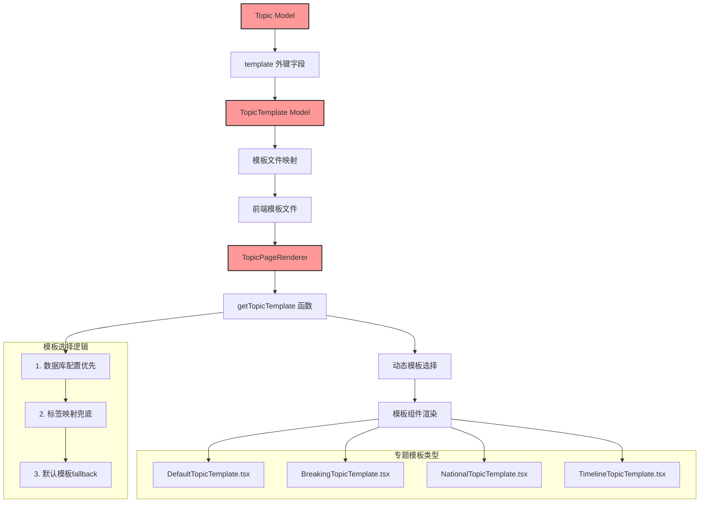
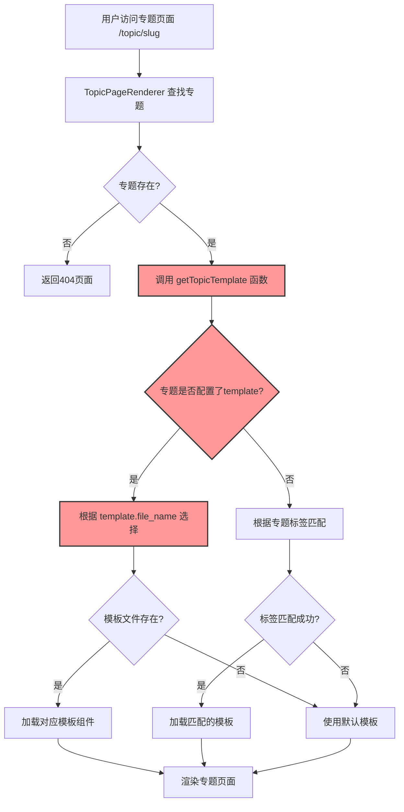
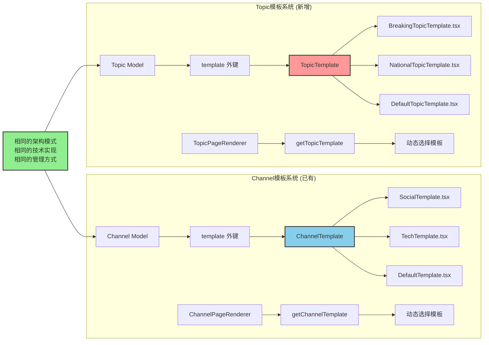
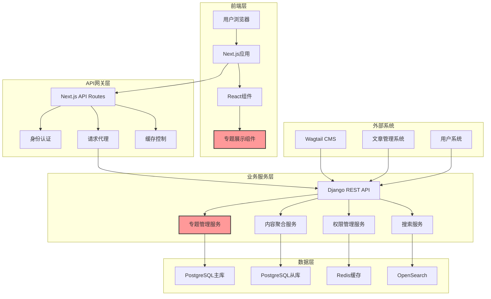
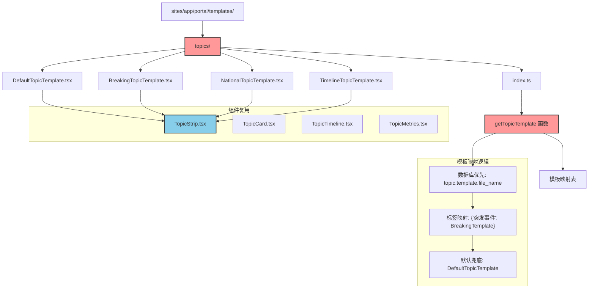
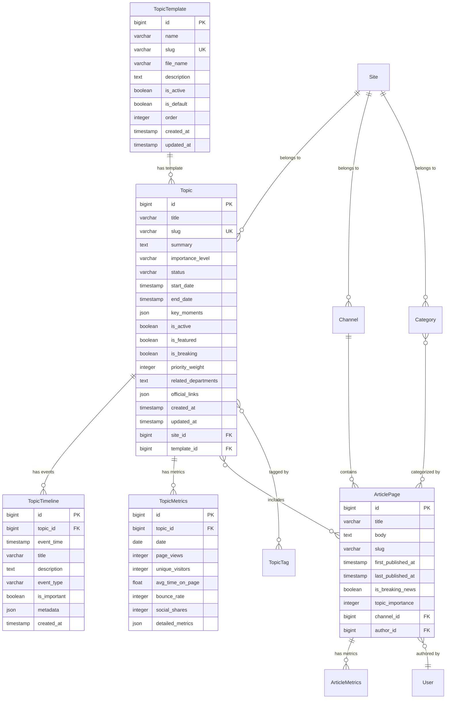
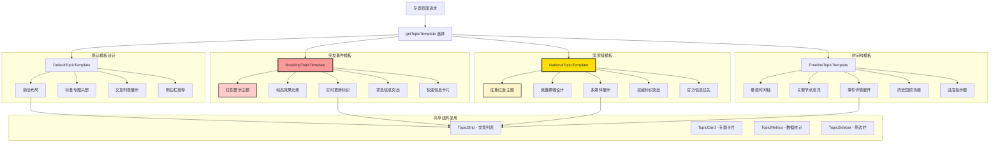
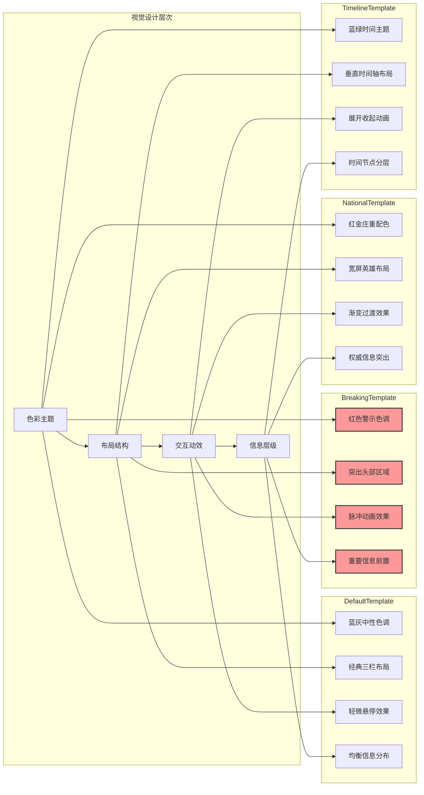
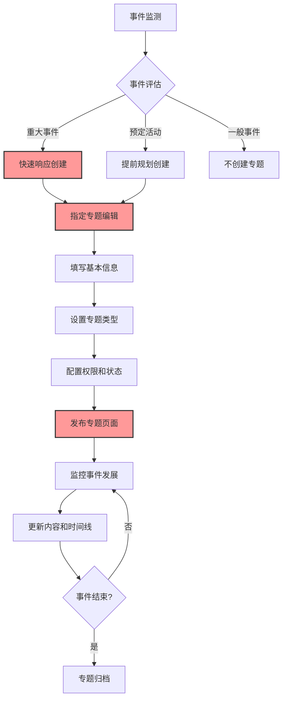
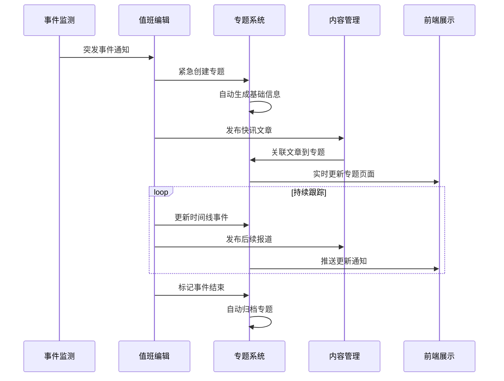

# 党报头条 - 专题系统详细设计文档

## 📋 项目概述

本文档详细描述党报头条专题系统的技术架构设计、数据模型设计、接口设计、前端设计、业务流程设计等技术实现细节。

### 设计目标
- 🎯 **功能目标**: 在现有Wagtail CMS基础上，增强重大事件深度跟踪能力
- 🏗️ **架构目标**: 与现有系统深度集成，复用成熟技术栈和设计模式
- 🔒 **安全目标**: 继承现有权限体系，确保内容安全和审核流程
- 📱 **体验目标**: 参考Channel模板系统，提供一致的用户体验

### 核心原则
```
专题系统 = Wagtail CMS 的功能增强模块（非独立系统）
设计原则 = 复用现有 + 渐进增强 + 保持一致 + 易维护
技术选型 = 现有技术栈 + Wagtail集成 + Channel模板机制复用
```

## 🏗️ 系统架构设计

### 专题模板系统架构

基于Channel模板系统的成功经验，Topic系统采用完全相同的模板架构：



### 模板选择流程图



### Channel vs Topic 模板系统对比



### 整体架构图



### 前端模板文件组织结构



### 模板技术实现架构

```mermaid
graph LR
    subgraph "数据层"
        A1[Topic Model] --> A2[template FK]
        A3[TopicTemplate Model] --> A4[file_name]
        A2 --> A3
    end
    
    subgraph "API层"
        B1[Django REST API] --> B2[Topic Serializer]
        B2 --> B3[包含 template 信息]
        A1 --> B1
    end
    
    subgraph "前端路由层"
        C1[/topic/[slug]/page.tsx] --> C2[TopicPageRenderer]
        B3 --> C1
    end
    
    subgraph "模板选择层"
        D1[getTopicTemplate 函数] --> D2{数据库配置?}
        D2 -->|是| D3[template.file_name]
        D2 -->|否| D4[标签映射]
        D3 --> D5[动态 import()]
        D4 --> D5
        C2 --> D1
    end
    
    subgraph "模板渲染层"
        E1[DefaultTopicTemplate]
        E2[BreakingTopicTemplate]  
        E3[NationalTopicTemplate]
        E4[TimelineTopicTemplate]
        
        D5 --> E1
        D5 --> E2
        D5 --> E3
        D5 --> E4
    end
    
    subgraph "组件层"
        F1[TopicStrip] --> F2[专题文章列表]
        F3[TopicTimeline] --> F4[事件时间线]
        F5[TopicMetrics] --> F6[专题数据统计]
        
        E1 --> F1
        E2 --> F1
        E3 --> F3
        E4 --> F3
    end
    
    style D1 fill:#ff9999,stroke:#333,stroke-width:2px
    style D2 fill:#ff9999,stroke:#333,stroke-width:2px
    style E2 fill:#ffcccc,stroke:#333,stroke-width:2px
```

### 核心组件架构

#### 1. 前端架构（Next.js + React）

```typescript
// 前端架构分层
interface TopicSystemArchitecture {
    // 页面层
    pages: {
        '/topic/[slug]': TopicDetailPage;
        '/topics': TopicListPage;
        '/admin/topics': TopicManagementPage;
    };
    
    // 组件层
    components: {
        display: TopicShowcase | TopicCard | TopicTimeline;
        forms: TopicEditor | TopicPublisher;
        layout: TopicLayout | TopicNavigation;
    };
    
    // 服务层
    services: {
        api: TopicService | ArticleService;
        auth: AuthService;
        cache: CacheService;
    };
    
    // 状态管理
    state: {
        global: TopicStore;
        local: useTopicState;
    };
}
```

#### 2. 后端架构（Django + DRF）

```python
# 后端服务架构
class TopicSystemServices:
    """专题系统后端服务架构"""
    
    # 核心服务
    topic_service = TopicManagementService()       # 专题管理
    content_service = ContentAggregationService()  # 内容聚合
    timeline_service = TopicTimelineService()      # 时间线管理
    publish_service = TopicPublishingService()     # 发布管理
    
    # 支撑服务
    auth_service = AuthenticationService()         # 认证授权
    cache_service = CacheManagementService()       # 缓存管理
    search_service = SearchService()               # 搜索服务
    notification_service = NotificationService()   # 通知服务
    
    # 外部集成
    cms_integration = WagtailIntegration()         # CMS集成
    elasticsearch_integration = ESIntegration()    # 搜索集成
```

### 技术栈选型

| 层次 | 技术选型 | 版本 | 用途说明 |
|------|----------|------|----------|
| **前端框架** | Next.js | 14.x | 服务端渲染、路由管理 |
| **UI库** | React | 18.x | 组件化开发 |
| **样式** | Tailwind CSS | 3.x | 原子化CSS框架 |
| **状态管理** | Zustand | 4.x | 轻量级状态管理 |
| **后端框架** | Django | 4.x | Web框架 |
| **API框架** | DRF | 3.x | REST API开发 |
| **数据库** | PostgreSQL | 15.x | 主数据存储 |
| **缓存** | Redis | 7.x | 缓存和会话存储 |
| **搜索引擎** | OpenSearch | 2.x | 全文检索 |
| **任务队列** | Celery | 5.x | 异步任务处理 |

## 🗄️ 数据库设计

### 数据库ER关系图



### 核心数据模型设计

#### 1. Topic 专题模型

```python
class Topic(ClusterableModel):
    """重大事件专题模型"""
    
    # === 基本信息 ===
    title = models.CharField(
        max_length=128, 
        verbose_name="专题标题",
        help_text="简洁明确的专题标题，如：四川6.8级地震救援"
    )
    slug = models.SlugField(
        unique=True, 
        max_length=150,
        verbose_name="URL标识",
        help_text="用于URL的唯一标识符"
    )
    summary = models.TextField(
        blank=True,
        verbose_name="专题摘要", 
        help_text="专题的简要描述，用于SEO和分享"
    )
    cover_image = models.ForeignKey(
        'wagtailimages.Image',
        null=True, blank=True,
        on_delete=models.SET_NULL,
        related_name='+',
        verbose_name="封面图片"
    )
    
    # === 专题分类 ===
    # 注意：移除固定的topic_type字段，使用灵活的标签系统
    # 管理员可通过tags字段灵活定义专题类型：国庆庆典、突发灾害、体育赛事等
    # 这样避免了分类边界模糊的问题，更符合Wagtail Snippet的简洁原则
    
    IMPORTANCE_LEVELS = [
        ('national', '国家级'),      # 全国重大影响
        ('major', '重大级'),         # 重要社会影响  
        ('regional', '区域级'),      # 区域性影响
        ('specialized', '专门级'),   # 特定领域影响
    ]
    importance_level = models.CharField(
        max_length=16, 
        choices=IMPORTANCE_LEVELS,
        default='major',
        verbose_name="重要程度"
    )
    
    STATUS_CHOICES = [
        ('upcoming', '即将开始'),     # 预告阶段
        ('ongoing', '正在进行'),      # 进行中
        ('concluded', '已结束'),      # 结束但仍关注
        ('archived', '已归档'),       # 完全结束
        ('memorial', '纪念回顾'),     # 周年纪念等
    ]
    status = models.CharField(
        max_length=16, 
        choices=STATUS_CHOICES,
        default='upcoming',
        verbose_name="专题状态"
    )
    
    # === 时间管理 ===
    start_date = models.DateTimeField(
        null=True, blank=True,
        verbose_name="事件开始时间",
        help_text="事件实际开始的时间"
    )
    end_date = models.DateTimeField(
        null=True, blank=True,
        verbose_name="事件结束时间", 
        help_text="事件实际结束的时间"
    )
    key_moments = models.JSONField(
        default=list, blank=True,
        verbose_name="关键时间点",
        help_text="事件发展过程中的关键时间节点"
    )
    
    # === 控制字段 ===
    is_active = models.BooleanField(
        default=True,
        verbose_name="是否启用",
        help_text="控制专题是否在前台显示"
    )
    is_featured = models.BooleanField(
        default=False,
        verbose_name="是否推荐",
        help_text="是否在首页等重要位置推荐展示"
    )
    is_breaking = models.BooleanField(
        default=False,
        verbose_name="是否突发重大事件",
        help_text="突发事件会获得最高展示优先级"
    )
    priority_weight = models.IntegerField(
        default=100,
        verbose_name="优先权重",
        help_text="数值越大优先级越高，范围：1-2000"
    )
    
    # === 多站点支持 ===
    sites = models.ManyToManyField(
        'wagtailcore.Site',
        blank=True,
        verbose_name="关联站点"
    )
    
    # === 扩展信息 ===
    related_departments = models.TextField(
        blank=True,
        verbose_name="相关部门",
        help_text="如：国防部、应急管理部、外交部等"
    )
    official_links = models.JSONField(
        default=list, blank=True,
        verbose_name="官方链接",
        help_text="相关的官方网站、直播链接等"
    )
    
    # === 模板系统 ===（参考Channel模板设计）
    template = models.ForeignKey(
        'TopicTemplate',
        on_delete=models.SET_NULL,
        null=True, blank=True,
        verbose_name="专题模板",
        help_text="选择专题的显示模板，如突发事件模板、国家级专题模板等"
    )
    
    # === 标签系统 ===
    tags = ClusterTaggableManager(
        through='news.TopicTag',
        blank=True,
        verbose_name="专题标签"
    )
    
    # === 时间戳 ===
    created_at = models.DateTimeField(
        auto_now_add=True,
        verbose_name="创建时间"
    )
    updated_at = models.DateTimeField(
        auto_now=True,
        verbose_name="更新时间"
    )
    
    class Meta:
        verbose_name = "重大事件专题"
        verbose_name_plural = "重大事件专题"
        ordering = [
            '-is_breaking',        # 突发事件优先
            '-priority_weight',    # 权重优先
            '-is_featured',        # 推荐优先
            '-start_date',         # 时间优先
        ]
        indexes = [
            models.Index(fields=['slug']),
            models.Index(fields=['importance_level', 'status']), 
            models.Index(fields=['status', 'is_active']),
            models.Index(fields=['-priority_weight', '-created_at']),
            models.Index(fields=['is_breaking', 'is_featured']),
            models.Index(fields=['template', 'is_active']),
        ]


# 专题模板模型（参考Channel模板系统）
class TopicTemplate(ClusterableModel):
    """专题模板管理 - 类似ChannelTemplate的设计模式"""
    
    name = models.CharField(
        max_length=100,
        verbose_name="模板名称",
        help_text="如：突发事件专题模板"
    )
    
    slug = models.SlugField(
        unique=True,
        verbose_name="模板标识",
        help_text="如：breaking，用于匹配专题标签"
    )
    
    file_name = models.CharField(
        max_length=100,
        verbose_name="模板文件名",
        help_text="如：BreakingTopicTemplate.tsx"
    )
    
    description = models.TextField(
        blank=True,
        verbose_name="描述"
    )
    
    is_active = models.BooleanField(
        default=True,
        verbose_name="是否启用"
    )
    
    is_default = models.BooleanField(
        default=False,
        verbose_name="是否为默认模板"
    )
    
    order = models.IntegerField(
        default=0,
        verbose_name="排序"
    )
    
    created_at = models.DateTimeField(auto_now_add=True)
    updated_at = models.DateTimeField(auto_now=True)
    
    class Meta:
        verbose_name = "专题模板"
        verbose_name_plural = "专题模板"
        ordering = ['order', 'name']
    
    def __str__(self):
        return self.name
    
    @classmethod
    def get_available_templates(cls):
        """获取可用模板"""
        return cls.objects.filter(is_active=True).order_by('order', 'name')
    
    @classmethod
    def get_default_template(cls):
        """获取默认模板"""
        return cls.objects.filter(is_default=True, is_active=True).first()


# 专题时间线模型
class TopicTimeline(models.Model):
    """专题时间线 - 记录重大事件发展过程"""
    
    topic = models.ForeignKey(
        Topic,
        on_delete=models.CASCADE,
        related_name='timeline_events',
        verbose_name="所属专题"
    )
    
    event_time = models.DateTimeField(
        verbose_name="事件时间",
        help_text="事件发生的具体时间"
    )
    
    title = models.CharField(
        max_length=200,
        verbose_name="事件标题",
        help_text="简洁描述事件内容"
    )
    
    description = models.TextField(
        verbose_name="事件描述",
        help_text="详细描述事件内容和影响"
    )
    
    EVENT_TYPES = [
        ('major_development', '重大进展'),
        ('latest_update', '最新消息'),
        ('official_announcement', '官方发布'),
        ('rescue_operation', '救援行动'),
        ('ceremony_segment', '仪式环节'),
        ('policy_release', '政策发布'),
        ('international_response', '国际反响'),
    ]
    event_type = models.CharField(
        max_length=32,
        choices=EVENT_TYPES,
        verbose_name="事件类型"
    )
    
    is_important = models.BooleanField(
        default=False,
        verbose_name="是否重要节点",
        help_text="重要节点会在时间线中突出显示"
    )
    
    source_url = models.URLField(
        blank=True,
        verbose_name="信息来源",
        help_text="相关新闻报道或官方发布的链接"
    )
    
    metadata = models.JSONField(
        default=dict, blank=True,
        verbose_name="扩展数据",
        help_text="存储额外的结构化数据"
    )
    
    created_at = models.DateTimeField(
        auto_now_add=True,
        verbose_name="创建时间"
    )
    
    class Meta:
        ordering = ['-event_time']
        verbose_name = "专题时间线"
        verbose_name_plural = "专题时间线"
        indexes = [
            models.Index(fields=['topic', '-event_time']),
            models.Index(fields=['event_type', 'is_important']),
        ]
```

#### 2. 数据表索引优化策略

```sql
-- 专题相关索引优化
CREATE INDEX CONCURRENTLY idx_topic_active_priority ON news_topic 
    (is_active, priority_weight DESC, created_at DESC);

CREATE INDEX CONCURRENTLY idx_topic_status_template ON news_topic 
    (status, template_id) WHERE is_active = true;

CREATE INDEX CONCURRENTLY idx_topic_breaking_featured ON news_topic 
    (is_breaking DESC, is_featured DESC) WHERE is_active = true;

-- 时间线相关索引
CREATE INDEX CONCURRENTLY idx_timeline_topic_time ON news_topictimeline 
    (topic_id, event_time DESC);

CREATE INDEX CONCURRENTLY idx_timeline_important ON news_topictimeline 
    (is_important, event_time DESC) WHERE is_important = true;

-- 文章专题关联索引
CREATE INDEX CONCURRENTLY idx_article_topics ON news_articlepage_topics 
    (topic_id, articlepage_id);
```

## 🔌 API接口设计

### RESTful API架构

#### API设计原则
- **RESTful**: 遵循REST架构风格
- **版本化**: 支持API版本管理
- **分页**: 大数据集合的分页处理
- **过滤**: 丰富的查询和过滤功能
- **缓存**: 合理的HTTP缓存策略
- **错误处理**: 统一的错误响应格式

### 核心API端点设计

#### 1. 专题管理API

```python
# 专题列表API
@api_view(['GET'])
@cache_page(300)  # 5分钟缓存
def topic_list(request):
    """
    获取专题列表
    
    查询参数:
- type: 专题类型筛选
- status: 状态筛选  
- importance: 重要程度筛选
    - is_breaking: 是否突发事件
    - is_featured: 是否推荐
    - page: 页码
    - page_size: 每页数量(默认20，最大100)
    - ordering: 排序方式
    
    返回格式:
    {
        "count": 总数量,
        "next": "下一页URL",
        "previous": "上一页URL", 
        "results": [专题对象列表]
    }
    """
    
    # 查询过滤
    queryset = Topic.objects.filter(is_active=True)
    
    # 参数过滤 - 使用标签和模板进行过滤
    template_slug = request.GET.get('template')
    if template_slug:
        queryset = queryset.filter(template__slug=template_slug)
    
    tags = request.GET.get('tags')
    if tags:
        tag_list = tags.split(',')
        queryset = queryset.filter(tags__name__in=tag_list).distinct()
    
    status = request.GET.get('status')
    if status:
        queryset = queryset.filter(status=status)
        
    importance = request.GET.get('importance')
    if importance:
        queryset = queryset.filter(importance_level=importance)
        
    is_breaking = request.GET.get('is_breaking')
    if is_breaking:
        queryset = queryset.filter(is_breaking=True)
        
    is_featured = request.GET.get('is_featured') 
    if is_featured:
        queryset = queryset.filter(is_featured=True)
    
    # 排序
    ordering = request.GET.get('ordering', '-created_at')
    allowed_orderings = [
        'created_at', '-created_at',
        'start_date', '-start_date',
        'priority_weight', '-priority_weight',
        'title', '-title'
    ]
    if ordering in allowed_orderings:
        queryset = queryset.order_by(ordering)
    
    # 分页
    paginator = PageNumberPagination()
    paginator.page_size_query_param = 'page_size'
    paginator.page_size = 20
    paginator.max_page_size = 100
    
    page = paginator.paginate_queryset(queryset, request)
    serializer = TopicListSerializer(page, many=True)
    
    return paginator.get_paginated_response(serializer.data)
```

### API响应格式规范

#### 1. 成功响应格式

```json
{
    "success": true,
    "data": {
        "id": 1,
        "title": "四川6.8级地震救援专题",
        "slug": "sichuan-earthquake-2024",
        "template": {
            "name": "突发事件专题模板",
            "slug": "breaking",
            "file_name": "BreakingTopicTemplate.tsx"
        },
        "importance_level": "national",
        "status": "ongoing",
        "is_breaking": true,
        "priority_weight": 2000,
        "tags": ["突发事件", "自然灾害", "地震"],
        "start_date": "2024-09-15T14:30:00Z",
        "end_date": null,
        "cover_image": {
            "url": "/media/images/earthquake-cover.jpg",
            "alt": "地震救援现场"
        },
        "summary": "四川发生6.8级地震，各方救援力量紧急出动...",
        "articles_count": 25,
        "created_at": "2024-09-15T14:45:00Z",
        "updated_at": "2024-09-15T18:30:00Z"
    },
    "meta": {
        "total_count": 1,
        "page": 1,
        "page_size": 20,
        "has_next": false
    }
}
```

#### 2. 错误响应格式

```json
{
    "success": false,
    "error": {
        "code": "TOPIC_NOT_FOUND",
        "message": "指定的专题不存在",
        "details": {
            "slug": "invalid-topic-slug"
        }
    },
    "meta": {
        "timestamp": "2024-09-15T18:30:00Z",
        "request_id": "req_123456789"
    }
}
```

## 🎨 前端UI设计

### 响应式设计架构

#### 设计理念
- **内容至上**: 突出专题内容，减少干扰元素
- **层次清晰**: 信息架构清晰，用户能快速找到所需内容
- **情感化设计**: 根据专题类型采用不同的视觉风格
- **无障碍访问**: 符合WCAG 2.1 AA标准的无障碍设计

#### 响应式断点策略

```css
/* 响应式断点定义 */
:root {
  --breakpoint-xs: 0;
  --breakpoint-sm: 640px;
  --breakpoint-md: 768px;
  --breakpoint-lg: 1024px;
  --breakpoint-xl: 1280px;
  --breakpoint-2xl: 1536px;
}

/* 专题页面布局 */
.topic-layout {
  display: grid;
  gap: 2rem;
  
  /* 移动端：单列布局 */
  grid-template-columns: 1fr;
  
  /* 平板端：主内容 + 侧栏 */
  @media (min-width: 768px) {
    grid-template-columns: 1fr 320px;
  }
  
  /* 桌面端：增加边距 */
  @media (min-width: 1024px) {
    max-width: 1200px;
    margin: 0 auto;
    padding: 0 2rem;
  }
}
```

### 专题模板差异化设计架构



### 模板视觉差异化设计



### 核心UI组件设计

#### TopicCard 专题卡片组件

```tsx
interface TopicCardProps {
  topic: Topic;
  variant?: 'default' | 'featured' | 'breaking' | 'timeline';
  size?: 'sm' | 'md' | 'lg';
  showMetrics?: boolean;
}

const TopicCard: React.FC<TopicCardProps> = ({
  topic,
  variant = 'default',
  size = 'md',
  showMetrics = false
}) => {
  const cardStyles = {
    default: 'bg-white border border-gray-200 rounded-lg shadow-sm hover:shadow-md',
    featured: 'bg-gradient-to-r from-blue-600 to-purple-600 text-white rounded-xl shadow-lg',
    breaking: 'bg-red-50 border-2 border-red-200 rounded-lg shadow-md animate-pulse',
    timeline: 'bg-gray-50 border-l-4 border-blue-500 rounded-r-lg'
  };

  // 根据专题标签动态获取图标
  const getTopicIcon = (topic) => {
    const tagIcons = {
      '国庆庆典': '🎊', '建党节': '🎊', '国家庆典': '🎊',
      '突发事件': '🚨', '地震': '🚨', '自然灾害': '🚨',
      '政治事件': '🏛️', '两会': '🏛️', '重要会议': '🏛️',
      '国际事务': '🌍', '外交访问': '🌍', '国际会议': '🌍',
      '体育赛事': '🏆', '奥运会': '🏆', '世界杯': '🏆',
      '科技成就': '🚀', '航天发射': '🚀', '重大突破': '🚀',
      '纪念活动': '🕯️', '追悼': '🕯️', '纪念日': '🕯️',
      '社会事件': '📢'
    };
    
    // 查找匹配的标签图标
    for (const tag of topic.tags || []) {
      if (tagIcons[tag]) return tagIcons[tag];
    }
    
    // 根据模板类型返回默认图标
    if (topic.template?.slug === 'breaking') return '🚨';
    if (topic.template?.slug === 'national') return '🎊';
    if (topic.template?.slug === 'timeline') return '⏰';
    
    return '📢'; // 默认图标
  };

  return (
    <div className={`${cardStyles[variant]} p-6 transition-all duration-200`}>
      {/* 专题标识 */}
      <div className="flex items-center justify-between mb-3">
        <div className="flex items-center space-x-2">
          <span className="text-2xl">{getTopicIcon(topic)}</span>
          {topic.is_breaking && (
            <span className="px-2 py-1 bg-red-500 text-white text-xs font-bold rounded-full animate-pulse">
              突发
            </span>
          )}
        </div>
      </div>

      {/* 标题和摘要 */}
      <h3 className="text-xl font-bold mb-2 line-clamp-2 hover:text-blue-600">
        <Link href={`/topic/${topic.slug}`}>
          {topic.title}
        </Link>
      </h3>
      
      {topic.summary && (
        <p className="text-gray-600 text-sm mb-4 line-clamp-3">
          {topic.summary}
        </p>
      )}
    </div>
  );
};
```

## ⚙️ 业务流程设计

### 专题生命周期管理流程

#### 专题创建流程



#### 突发事件响应流程



## 🚀 部署和运维设计

### 容器化部署架构

#### Docker容器配置

```dockerfile
# 后端Django容器
FROM python:3.11-slim

WORKDIR /app

# 安装系统依赖
RUN apt-get update && apt-get install -y \
    postgresql-client \
    redis-tools \
    nginx \
    && rm -rf /var/lib/apt/lists/*

# 安装Python依赖
COPY requirements.txt .
RUN pip install --no-cache-dir -r requirements.txt

# 复制应用代码
COPY . .

# 设置环境变量
ENV DJANGO_SETTINGS_MODULE=config.settings.production
ENV PYTHONPATH=/app

# 启动脚本
COPY scripts/start.sh /start.sh
RUN chmod +x /start.sh

EXPOSE 8000
CMD ["/start.sh"]
```

### 性能监控和告警

#### 监控指标体系

```python
# monitoring/metrics.py
from prometheus_client import Counter, Histogram, Gauge
import time
import functools

# 专题系统监控指标
TOPIC_REQUESTS = Counter(
    'topic_requests_total',
    '专题请求总数',
    ['method', 'endpoint', 'status']
)

TOPIC_REQUEST_DURATION = Histogram(
    'topic_request_duration_seconds',
    '专题请求处理时间',
    ['endpoint']
)

ACTIVE_TOPICS = Gauge(
    'active_topics_count',
    '活跃专题数量'
)

def monitor_endpoint(endpoint_name):
    """监控API端点的装饰器"""
    def decorator(func):
        @functools.wraps(func)
        def wrapper(request, *args, **kwargs):
            start_time = time.time()
            try:
                response = func(request, *args, **kwargs)
                TOPIC_REQUESTS.labels(
                    method=request.method,
                    endpoint=endpoint_name,
                    status=response.status_code
                ).inc()
                return response
            finally:
                duration = time.time() - start_time
                TOPIC_REQUEST_DURATION.labels(endpoint=endpoint_name).observe(duration)
        return wrapper
    return decorator
```

### 测试策略

#### 单元测试

```python
# tests/test_topic_models.py
import pytest
from django.test import TestCase
from django.core.exceptions import ValidationError
from news.models import Topic, TopicTimeline

class TopicModelTests(TestCase):
    """专题模型测试"""
    
    def setUp(self):
        self.topic_data = {
            'title': '测试专题',
            'slug': 'test-topic',
            'importance_level': 'national',
            'status': 'ongoing',
            'is_breaking': True,
            'priority_weight': 2000
        }
    
    def test_create_topic(self):
        """测试创建专题"""
        topic = Topic.objects.create(**self.topic_data)
        
        assert topic.title == '测试专题'
        assert topic.slug == 'test-topic'
        assert topic.is_breaking is True
        assert topic.status == 'ongoing'
        
    def test_topic_slug_unique(self):
        """测试专题slug唯一性"""
        Topic.objects.create(**self.topic_data)
        
        with pytest.raises(ValidationError):
            duplicate_topic = Topic(**self.topic_data)
            duplicate_topic.full_clean()
```

#### 集成测试

```python
# tests/test_topic_api.py
from rest_framework.test import APITestCase
from rest_framework import status
from django.contrib.auth.models import User, Group
from news.models import Topic

class TopicAPITests(APITestCase):
    """专题API集成测试"""
    
    def setUp(self):
        # 创建测试用户和权限组
        self.admin_user = User.objects.create_user(
            username='admin',
            password='testpass'
        )
        admin_group = Group.objects.create(name='TopicAdmins')
        self.admin_user.groups.add(admin_group)
        
        # 创建测试专题
        self.topic = Topic.objects.create(
            title='测试专题',
            slug='test-topic',
            importance_level='national',
            is_active=True
        )
        # 添加测试标签
        self.topic.tags.add('突发事件', '测试')
    
    def test_topic_list_api(self):
        """测试专题列表API"""
        url = '/api/topics/'
        response = self.client.get(url)
        
        self.assertEqual(response.status_code, status.HTTP_200_OK)
        self.assertEqual(len(response.data['results']), 1)
        self.assertEqual(response.data['results'][0]['slug'], 'test-topic')
```

---

## 📋 项目总结

### 设计文档完整性检查

本设计文档涵盖了专题系统的以下关键方面：

✅ **系统架构设计** - 完整的前后端架构和技术选型  
✅ **数据库设计** - 详细的ER图和模型设计  
✅ **API接口设计** - RESTful API规范和性能优化  
✅ **前端UI设计** - 响应式设计和组件化架构  
✅ **业务流程设计** - 完整的专题生命周期管理  
✅ **部署运维设计** - 容器化部署和监控告警  
✅ **测试策略** - 单元测试、集成测试、性能测试  

### 实施路线图

#### 第一阶段（1-2个月）：基础功能
- [ ] 数据模型实现和迁移
- [ ] 核心API接口开发  
- [ ] 基础前端页面开发
- [ ] 专题CRUD功能实现

#### 第二阶段（3-4个月）：高级功能  
- [ ] 时间线功能开发
- [ ] 权限管理系统实现
- [ ] 内容聚合算法优化
- [ ] 性能监控系统搭建

#### 第三阶段（5-6个月）：生产优化
- [ ] 缓存优化和CDN部署
- [ ] 监控告警系统完善
- [ ] 自动化测试和CI/CD
- [ ] 用户体验优化

### 关键成功因素

1. **架构合理性** - 分层清晰、模块解耦、易于维护
2. **性能优化** - 多层缓存、数据库优化、CDN加速
3. **安全保障** - 权限控制、数据验证、监控告警
4. **运维自动化** - 容器化部署、持续集成、健康监控
5. **团队协作** - 文档规范、代码审查、知识分享

---

**文档版本**: v3.0  
**最后更新**: 2025年9月28日  
**文档类型**: 详细设计文档  
**维护团队**: 党报头条技术开发组  
**联系方式**: 内部技术群 或 提交Issue到项目仓库

### 版本更新记录
- **v3.0** (2025-09-28): 重大架构调整 - 移除topic_type字段，增加专题模板系统，强调与Wagtail CMS深度集成
- **v2.0** (2025-09-28): 完整的技术设计文档，包含架构设计、数据模型、API设计等
- **v1.0** (2025-09-28): 初版设计文档

> 🎯 **设计理念**: 本设计文档基于现有Wagtail CMS架构，遵循"复用成功模式、渐进式增强"的原则。专题系统不是独立系统，而是对现有CMS的功能增强，特别是复用了Channel模板系统的成功经验，确保架构一致性和维护便利性。