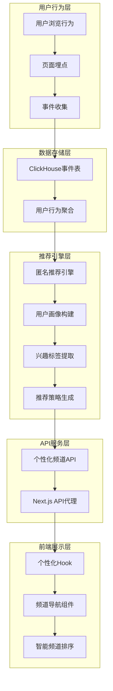

# IDP-CMS 个性化推荐系统

## 系统概述

IDP-CMS 个性化推荐系统是一个基于用户行为分析的智能内容推荐引擎，通过分析用户的浏览、点击、停留等行为数据，为用户提供个性化的频道排序和内容推荐服务。

## 系统架构

### 整体架构图



### 技术栈

- **数据存储**: ClickHouse (用户行为事件存储)
- **后端框架**: Django REST Framework
- **前端框架**: Next.js 15 + React 18
- **实时通信**: Server-Sent Events (SSE)
- **缓存策略**: Django Cache Framework + 浏览器缓存

## 核心组件

### 1. 用户行为追踪系统

#### 1.1 埋点事件类型
```typescript
export type TrackingEvent =
  | "impression"  // 内容曝光
  | "click"       // 点击事件
  | "dwell"       // 停留时间
  | "view"        // 页面浏览
  | "search";     // 搜索行为
```

#### 1.2 数据结构
```sql
CREATE TABLE events (
  ts DateTime64(3, 'UTC'),    -- 事件时间戳
  user_id String,             -- 用户ID
  device_id String,           -- 设备ID
  session_id String,          -- 会话ID
  event String,               -- 事件类型
  article_id String,          -- 文章ID
  channel String,             -- 频道
  site String,                -- 站点
  dwell_ms UInt32 DEFAULT 0   -- 停留时间(毫秒)
);
```

#### 1.3 停留时间计算
使用 Intersection Observer API 精确计算用户在内容上的停留时间：

```typescript
// 当元素进入视口时记录时间戳
if (isEntering && !wasIntersecting) {
  enterTimeRef.current = Date.now();
}

// 当元素离开视口时计算停留时间
else if (!isEntering && wasIntersecting) {
  const dwellTime = Date.now() - enterTimeRef.current;
  onLeave?.(entry.target, dwellTime);
}
```

### 2. 用户画像构建引擎

#### 2.1 兴趣标签提取算法
```python
def _extract_interests(self, device_history: List[Dict], session_behavior: List[Dict]) -> Dict[str, float]:
    """提取用户兴趣标签"""
    interests = {}
    
    # 基于设备历史 - 长期偏好
    for behavior in device_history:
        channel = behavior["channel"]
        # 权重 = 观看次数 × 平均停留时间
        weight = behavior["view_count"] * (behavior["avg_dwell"] / 1000)
        interests[channel] = interests.get(channel, 0) + weight
    
    # 基于当前会话 - 短期偏好（权重翻倍）
    for behavior in session_behavior:
        if behavior["event"] == "view":
            channel = behavior["channel"]
            weight = behavior["dwell_ms"] / 1000  # 停留时间转为秒
            interests[channel] = interests.get(channel, 0) + weight * 2
    
    # 归一化处理
    total_weight = sum(interests.values())
    if total_weight > 0:
        interests = {k: v / total_weight for k, v in interests.items()}
    
    return interests
```

#### 2.2 置信度计算
```python
def _calculate_confidence(self, device_history: List[Dict], session_behavior: List[Dict]) -> float:
    """计算用户画像置信度"""
    confidence = 0.0
    
    # 基于设备历史数据量
    if device_history:
        total_views = sum(b["view_count"] for b in device_history)
        confidence += min(total_views / 50, 1.0) * 0.4  # 最多贡献40%
    
    # 基于会话活跃度
    if session_behavior:
        confidence += min(len(session_behavior) / 5, 1.0) * 0.6  # 最多贡献60%
    
    return min(confidence, 1.0)
```

### 3. 推荐策略引擎

#### 3.1 三层推荐策略

##### 冷启动策略 (置信度 < 0.3)
- **适用场景**: 新用户或数据不足
- **策略**: 展示所有活跃频道，平均权重分配
- **多样性增强**: 30% 多样性提升
- **目标**: 收集用户初始偏好数据

```python
strategy = {
    "type": "cold_start",
    "channels": active_channels,  # 所有活跃频道
    "weights": self._calculate_equal_weights(active_channels),
    "diversity_boost": 0.3
}
```

##### 混合推荐策略 (0.3 ≤ 置信度 < 0.7)
- **适用场景**: 有一定数据但不够充分
- **策略**: 结合用户偏好频道和热门频道
- **频道选择**: 用户偏好前5 + 热门频道前3
- **多样性增强**: 20% 多样性提升

```python
preferred_channel_names = [ch[0] for ch in preferred_channels[:5]]
popular_channels = [ch for ch in active_channels[:3] if ch not in preferred_channel_names]
hybrid_channels = preferred_channel_names + popular_channels

strategy = {
    "type": "hybrid",
    "channels": hybrid_channels,
    "weights": self._calculate_channel_weights(preferred_channels, interests),
    "diversity_boost": 0.2
}
```

##### 个性化推荐策略 (置信度 ≥ 0.7)
- **适用场景**: 用户数据充足，偏好明确
- **策略**: 完全基于用户历史行为排序
- **频道选择**: 用户偏好前8个频道
- **多样性增强**: 10-20% (根据用户多样性偏好调整)

```python
strategy = {
    "type": "personalized",
    "channels": [ch[0] for ch in preferred_channels[:8]],
    "weights": self._calculate_channel_weights(preferred_channels, interests),
    "diversity_boost": 0.1 if diversity_level == "low" else 0.2
}
```

#### 3.2 权重计算算法
```python
def _calculate_channel_weights(self, preferred_channels: List[Tuple[str, float]], interests: Dict[str, float]) -> Dict[str, float]:
    """计算频道权重"""
    weights = {}
    
    # 基于偏好频道排序
    for channel, weight in preferred_channels:
        weights[channel] = weight
    
    # 基于兴趣标签增强 (50%权重)
    for channel, interest in interests.items():
        weights[channel] = weights.get(channel, 0) + interest * 0.5
    
    # 归一化处理
    total_weight = sum(weights.values())
    if total_weight > 0:
        weights = {k: v / total_weight for k, v in weights.items()}
    
    return weights
```

### 4. API服务架构

#### 4.1 Django后端API
```python
@require_http_methods(["GET"])
@cache_page(60 * 5)  # 5分钟缓存
def personalized_channels(request):
    """个性化频道API"""
    try:
        site = get_site_from_request(request)
        
        # 获取用户推荐配置
        rec_config = get_anonymous_recommendation_config(request, site)
        strategy = rec_config.get("strategy", {})
        profile = rec_config.get("profile", {})
        
        # 获取频道数据并排序
        all_channels = get_site_channels(site)
        personalized_channels_list = _sort_channels_by_strategy(
            all_channels, strategy, profile
        )
        
        return JsonResponse({
            "channels": personalized_channels_list,
            "strategy": strategy.get("type", "fallback"),
            "confidence": profile.get("confidence_score", 0.0),
            "interests": profile.get("interests", {})
        })
        
    except Exception as e:
        # 降级策略
        return fallback_response(request, e)
```

#### 4.2 Next.js API代理
```typescript
export async function GET(request: NextRequest) {
  try {
    const backendUrl = endpoints.getCmsEndpoint('/api/channels/personalized/');
    
    // 转发用户标识头
    const headers = {
      'x-device-id': request.headers.get('x-device-id'),
      'x-session-id': request.headers.get('x-session-id'),
      'x-user-id': request.headers.get('x-user-id'),
    };
    
    const response = await fetch(backendUrl, { headers });
    const data = await response.json();
    
    return NextResponse.json(data);
    
  } catch (error) {
    // 降级到静态频道
    return NextResponse.json(fallbackChannels);
  }
}
```

### 5. 前端个性化组件

#### 5.1 个性化Hook
```typescript
export function usePersonalizedChannels(
  staticChannels: Array<{id: string, name: string, slug: string}> = [],
  options: UsePersonalizedChannelsOptions = {}
) {
  const [personalizedChannels, setPersonalizedChannels] = useState([]);
  const [strategy, setStrategy] = useState('loading');
  const [confidence, setConfidence] = useState(0);
  
  const fetchPersonalizedChannels = useCallback(async () => {
    const session = getUserSession();
    const headers = {
      'X-Device-ID': session.deviceId,
      'X-Session-ID': session.sessionId,
      'X-User-ID': session.userId,
    };

    const response = await fetch('/api/channels/personalized', { headers });
    return response.json();
  }, []);

  // 缓存策略和自动刷新逻辑
  // ...
  
  return {
    channels: personalizedChannels,
    strategy,
    confidence,
    loading,
    error,
    refresh
  };
}
```

#### 5.2 智能状态指示器
```typescript
const getPersonalizationIndicator = () => {
  if (strategy === 'personalized') {
    return (
      <div className="text-xs text-blue-600 flex items-center">
        <div className="w-2 h-2 bg-blue-500 rounded-full mr-1"></div>
        个性化 {Math.round(confidence * 100)}%
      </div>
    );
  }
  
  if (strategy === 'hybrid') {
    return (
      <div className="text-xs text-green-600 flex items-center">
        <div className="w-2 h-2 bg-green-500 rounded-full mr-1"></div>
        智能推荐
      </div>
    );
  }
  
  return null;
};
```

## 数据流程

### 1. 用户行为收集
```
用户浏览文章 → 埋点触发 → 事件队列 → 批量发送 → ClickHouse存储
```

### 2. 实时画像更新
```
新事件入库 → 触发画像重算 → 更新兴趣权重 → 调整推荐策略
```

### 3. 个性化展示
```
页面加载 → 调用个性化API → 获取排序频道 → 渲染个性化界面
```

## 性能优化

### 1. 缓存策略
- **API缓存**: 5分钟服务端缓存
- **浏览器缓存**: 5分钟客户端缓存
- **会话缓存**: 用户会话期间缓存画像数据

### 2. 降级机制
- **API失败降级**: 自动切换到静态频道
- **数据不足降级**: 冷启动策略兜底
- **性能降级**: 超时自动使用缓存数据

### 3. 批量处理
- **事件批量上报**: 减少网络请求
- **数据批量查询**: 优化数据库性能
- **权重批量计算**: 提升计算效率

## 监控与分析

### 1. 实时监控指标
- 推荐策略分布 (冷启动/混合/个性化)
- 用户画像置信度分布
- API响应时间和成功率
- 频道点击率和停留时间

### 2. A/B测试支持
- 推荐算法版本对比
- 个性化开关效果测试
- 不同权重参数优化

### 3. 用户行为分析
- 个性化频道点击率提升
- 用户会话时长变化
- 内容消费多样性分析

## 部署与运维

### 1. 服务部署
```yaml
# Docker Compose 配置
services:
  authoring:  # Django后端
    image: local-authoring
    ports: ["8000:8000"]
  
  sites:      # Next.js前端
    image: local-sites  
    ports: ["3001:3000"]
  
  clickhouse: # 数据存储
    image: clickhouse/clickhouse-server:24.3
    ports: ["9123:9000", "8123:8123"]
```

### 2. 监控配置
- ClickHouse查询性能监控
- Django API响应时间监控
- Next.js前端性能监控
- 用户行为数据质量监控

## 未来优化方向

### 1. 算法优化
- **深度学习模型**: 引入神经网络提升推荐精度
- **多维度特征**: 加入时间、地理位置等特征
- **实时学习**: 在线学习算法快速适应用户偏好变化

### 2. 功能扩展
- **跨设备推荐**: 统一用户多设备行为数据
- **社交推荐**: 基于社交关系的协同过滤
- **内容推荐**: 从频道推荐扩展到具体文章推荐

### 3. 性能提升
- **边缘计算**: CDN层面的个性化缓存
- **预计算**: 离线批处理用户画像
- **流式处理**: 实时流处理用户行为事件

## 总结

IDP-CMS个性化推荐系统通过完整的用户行为分析链路，实现了从数据收集、画像构建、策略生成到前端展示的全流程个性化服务。系统具有良好的扩展性、稳定性和性能表现，为用户提供了智能化的内容发现体验。

通过三层推荐策略的设计，系统能够适应不同数据丰富度的用户场景，既保证了新用户的内容多样性，又为老用户提供了精准的个性化推荐，有效提升了用户参与度和内容消费效率。
