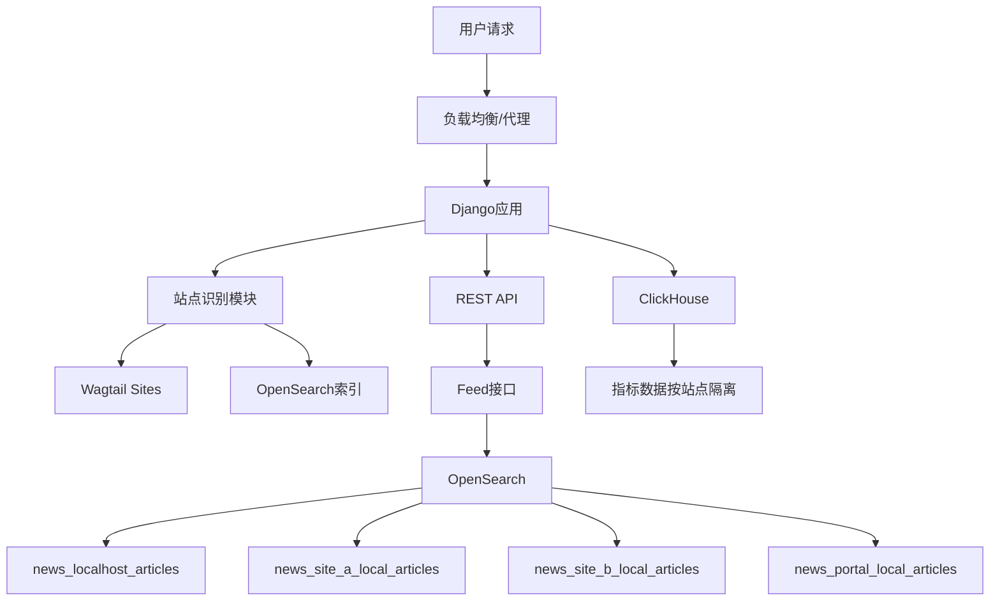

# 多站点架构指南

## 概述

本文档详细介绍了 IDP-CMS 的多站点架构设计、实现原理和使用指南。多站点架构允许在同一套系统中管理多个独立的站点，每个站点拥有独立的内容、配置和数据隔离。

## 目录

- [设计原理](#设计原理)
- [核心组件](#核心组件)
- [站点配置](#站点配置)
- [数据隔离](#数据隔离)
- [API 使用](#api-使用)
- [管理指令](#管理指令)
- [开发指南](#开发指南)
- [故障排除](#故障排除)
- [最佳实践](#最佳实践)

## 设计原理

### 架构图



### 核心原理

1. **站点识别**: 通过 Host header 或 URL 参数识别当前站点
2. **数据隔离**: 每个站点使用独立的 OpenSearch 索引
3. **配置管理**: 统一的站点配置和映射系统
4. **内容管理**: 集成 Wagtail Sites 框架进行内容管理

## 核心组件

### 1. 站点识别模块 (`apps/core/site_utils.py`)

```python
def get_site_from_request(request) -> str:
    """
    站点识别优先级:
    1. URL参数 ?site=
    2. Host header
    3. 默认配置
    """
```

**功能特性:**
- 支持多种识别方式
- 站点名称规范化
- 缓存机制优化性能
- 容错处理

### 2. 索引管理 (`apps/searchapp/client.py`)

```python
def index_name_for(site: str) -> str:
    """生成站点对应的索引名称"""
    normalized_site = normalize_site_identifier(site)
    return f"news_{normalized_site}_articles"
```

**索引命名规则:**
- `localhost` → `news_localhost_articles`
- `site-a.local` → `news_site_a_local_articles`
- `site-b.local` → `news_site_b_local_articles`
- `portal.local` → `news_portal_local_articles`

### 3. API 端点 (`apps/api/rest/feed.py`)

```python
@api_view(["GET"])
def feed(request):
    site = get_site_from_request(request)
    # 使用站点特定的索引查询数据
```

## 站点配置

### 当前支持的站点

| 站点标识符 | 域名 | 描述 | 索引名称 |
|----------|------|------|----------|
| `localhost` | `localhost`, `127.0.0.1` | 开发环境 | `news_localhost_articles` |
| `site-a.local` | `site-a.local` | 站点A | `news_site_a_local_articles` |
| `site-b.local` | `site-b.local` | 站点B | `news_site_b_local_articles` |
| `portal.local` | `portal.local` | 门户站点 | `news_portal_local_articles` |

### 配置文件位置

1. **Django 设置** (`authoring/authoring/settings/base.py`):
```python
SITE_HOSTNAME = os.getenv("SITE_HOSTNAME", "localhost")
MULTI_SITE_ENABLED = True
DEFAULT_SITE_IDENTIFIER = "localhost"
```

2. **环境变量** (`.env`):
```bash
SITE_HOSTNAME=localhost
```

3. **站点映射** (`apps/core/site_utils.py`):
```python
SITE_MAPPINGS = {
    'localhost': 'localhost',
    'site-a.local': 'site-a.local',
    'site-b.local': 'site-b.local',
    'portal.local': 'portal.local',
}
```

## 数据隔离

### OpenSearch 索引隔离

每个站点使用独立的 OpenSearch 索引，确保数据完全隔离：

```bash
# 查看所有站点索引
curl -u admin:OpenSearch2024! -X GET "http://localhost:9200/_cat/indices?v" | grep news

# 示例输出:
# news_localhost_articles_v1
# news_site_a_local_articles_v1
# news_site_b_local_articles_v1
# news_portal_local_articles_v1
```

### ClickHouse 数据隔离

分析数据按 `site` 字段进行逻辑隔离：

```sql
-- 查询特定站点的指标数据
SELECT site, article_id, sum(clicks), sum(impressions)
FROM article_metrics_agg
WHERE site = 'site-a.local'
GROUP BY site, article_id;
```

### Wagtail Sites 集成

利用 Wagtail 的 Sites 框架管理站点配置：

```python
# 查询站点配置
from wagtail.models import Site
sites = Site.objects.all()
for site in sites:
    print(f"{site.hostname} -> {site.site_name}")
```

## API 使用

### 基础用法

#### 1. 通过 Host Header 识别站点

```bash
# 请求 site-a.local 的内容
curl -X GET "http://localhost:8000/api/feed?size=5" \
     -H "Host: site-a.local" \
     -H "Accept: application/json"
```

#### 2. 通过 URL 参数指定站点

```bash
# 显式指定站点参数
curl -X GET "http://localhost:8000/api/feed?site=site-b.local&size=5" \
     -H "Accept: application/json"
```

### API 响应示例

```json
{
  "items": [
    {
      "article_id": "2001",
      "site": "site-a.local",
      "title": "Site A News: AI技术突破",
      "author": "Site A科技记者",
      "publish_time": "2025-08-25T14:30:00",
      "quality_score": 8.5
    }
  ],
  "next_cursor": "eyJzZWVuIjogWyIyMDAxIl0sICJ0cyI6IDE3NTYxMDM0MDB9",
  "debug": {
    "site": "site-a.local",
    "host": "site-a.local",
    "hours": 72,
    "template": "recommend_default"
  }
}
```

### 前端集成

Next.js 前端自动处理站点识别：

```typescript
// portal/next/src/lib/feed.ts
export async function fetchFeed(nextCursor?: string, sortBy?: string, site?: string) {
  const url = new URL("/api/feed", window.location.origin);
  
  if (site) {
    url.searchParams.set("site", site);
  }
  
  const res = await fetch(url.toString(), {
    headers: {
      "X-Forwarded-Host": window.location.hostname
    }
  });
  
  return res.json();
}
```

## 管理指令

### 站点设置指令

```bash
# 创建所有站点的 Wagtail Sites 配置
docker compose -f infra/local/docker-compose.yaml exec authoring \
  python authoring/manage.py setup_sites --create-sites

# 创建所有站点的 OpenSearch 索引
docker compose -f infra/local/docker-compose.yaml exec authoring \
  python authoring/manage.py setup_sites --create-indices

# 完整设置（创建站点和索引）
docker compose -f infra/local/docker-compose.yaml exec authoring \
  python authoring/manage.py setup_sites
```

### 索引管理指令

```bash
# 为特定站点创建索引
docker compose -f infra/local/docker-compose.yaml exec authoring \
  python authoring/manage.py os_alias_bootstrap --site site-a.local

# 查看所有索引别名
curl -u admin:OpenSearch2024! -X GET "http://localhost:9200/_cat/aliases?v"
```

### 数据导入示例

```bash
# 使用 Django shell 添加测试数据
docker compose -f infra/local/docker-compose.yaml exec authoring \
  python authoring/manage.py shell -c "
from apps.searchapp.client import get_client
from datetime import datetime

client = get_client()
doc = {
    'article_id': '5001',
    'site': 'site-a.local',
    'title': 'Site A 独家新闻',
    'body': '这是 Site A 的独家内容...',
    'author': 'Site A 编辑',
    'publish_time': datetime.now().isoformat(),
    'topic': 'news',
    'quality_score': 8.0
}

client.index(
    index='news_site_a_local_articles_v1',
    id=doc['article_id'],
    body=doc
)
print('✅ 数据添加成功')
"
```

## 开发指南

### 添加新站点

#### 1. 更新站点映射

编辑 `apps/core/site_utils.py`:

```python
SITE_MAPPINGS = {
    # 现有站点...
    'new-site.com': 'new-site.com',  # 新增站点
}

def get_available_sites() -> dict:
    return {
        # 现有站点...
        'new_site_com': {
            'name': 'New Site',
            'domains': ['new-site.com'],
            'description': '新站点',
            'is_default': False,
        }
    }
```

#### 2. 更新环境配置

添加到 `ALLOWED_HOSTS` 和其他相关配置：

```python
# authoring/authoring/settings/base.py
ALLOWED_HOSTS = [
    'localhost', '127.0.0.1', 
    'site-a.local', 'site-b.local', 
    'portal.local', 'new-site.com'  # 新增
]
```

#### 3. 创建站点资源

```bash
# 运行设置指令创建新站点的资源
docker compose exec authoring python authoring/manage.py setup_sites
```

### 站点特定功能开发

#### 1. 获取当前站点

```python
from apps.core.site_utils import get_site_from_request

def my_view(request):
    current_site = get_site_from_request(request)
    # 基于站点进行不同的处理
    if current_site == 'site-a.local':
        # Site A 特定逻辑
        pass
    elif current_site == 'site-b.local':
        # Site B 特定逻辑
        pass
```

#### 2. 站点特定模板

```python
# 在视图中使用站点特定模板
def article_detail(request, article_id):
    site = get_site_from_request(request)
    template_name = f"articles/{site}/detail.html"
    # 如果站点特定模板不存在，回退到默认模板
    if not template_exists(template_name):
        template_name = "articles/detail.html"
    
    return render(request, template_name, context)
```

#### 3. 站点特定配置

```python
# 站点特定的配置管理
SITE_SPECIFIC_CONFIGS = {
    'site-a.local': {
        'max_articles_per_page': 20,
        'enable_comments': True,
        'theme': 'blue'
    },
    'site-b.local': {
        'max_articles_per_page': 15,
        'enable_comments': False,
        'theme': 'red'
    }
}

def get_site_config(site: str, key: str, default=None):
    return SITE_SPECIFIC_CONFIGS.get(site, {}).get(key, default)
```

### 测试指南

#### 1. 单元测试

```python
# tests/test_site_utils.py
from django.test import TestCase, RequestFactory
from apps.core.site_utils import get_site_from_request

class SiteUtilsTestCase(TestCase):
    def setUp(self):
        self.factory = RequestFactory()
    
    def test_site_identification_by_host(self):
        request = self.factory.get('/', HTTP_HOST='site-a.local')
        site = get_site_from_request(request)
        self.assertEqual(site, 'site-a.local')
    
    def test_site_identification_by_param(self):
        request = self.factory.get('/?site=site-b.local')
        site = get_site_from_request(request)
        self.assertEqual(site, 'site-b.local')
```

#### 2. API 测试

```bash
# 测试所有站点的 API 功能
sites=("localhost" "site-a.local" "site-b.local" "portal.local")

for site in "${sites[@]}"; do
    echo "=== 测试站点: $site ==="
    curl -s -X GET "http://localhost:8000/api/feed?size=1" \
         -H "Host: $site" \
         -H "Accept: application/json" | \
    python3 -c "
import json, sys
data = json.load(sys.stdin)
print(f'站点: {data[\"debug\"][\"site\"]}')
print(f'文章数量: {len(data[\"items\"])}')
"
done
```

## 故障排除

### 常见问题

#### 1. 索引不存在错误

**错误信息**: `NotFoundError: no such index [news_site_a_articles]`

**解决方案**:
```bash
# 检查索引是否存在
curl -u admin:OpenSearch2024! -X GET "http://localhost:9200/_cat/indices?v" | grep news

# 创建缺失的索引
docker compose exec authoring python authoring/manage.py setup_sites --create-indices
```

#### 2. 站点识别失败

**症状**: API 返回默认站点的数据而不是预期站点

**检查步骤**:
```bash
# 1. 检查 Host header
curl -v -X GET "http://localhost:8000/api/feed" -H "Host: site-a.local"

# 2. 检查站点映射配置
docker compose exec authoring python authoring/manage.py shell -c "
from apps.core.site_utils import SITE_MAPPINGS
print(SITE_MAPPINGS)
"

# 3. 检查调试信息
curl -X GET "http://localhost:8000/api/feed?size=1" -H "Host: site-a.local" | \
python3 -c "import json, sys; data=json.load(sys.stdin); print(data['debug'])"
```

#### 3. Wagtail Sites 配置问题

**检查 Wagtail Sites 配置**:
```bash
docker compose exec authoring python authoring/manage.py shell -c "
from wagtail.models import Site
for site in Site.objects.all():
    print(f'{site.id}: {site.hostname} -> {site.site_name} (default: {site.is_default_site})')
"
```

### 日志调试

#### 1. 启用站点识别日志

```python
# authoring/authoring/settings/dev.py
LOGGING = {
    'version': 1,
    'disable_existing_loggers': False,
    'handlers': {
        'console': {
            'class': 'logging.StreamHandler',
        },
    },
    'loggers': {
        'apps.core.site_utils': {
            'handlers': ['console'],
            'level': 'DEBUG',
        },
    },
}
```

#### 2. 查看容器日志

```bash
# 查看 Django 应用日志
docker compose logs -f authoring

# 查看特定时间段的日志
docker compose logs --since="5m" authoring
```

### 性能监控

#### 1. 索引性能

```bash
# 检查索引大小和文档数量
curl -u admin:OpenSearch2024! -X GET "http://localhost:9200/_cat/indices?v&h=index,docs.count,store.size"

# 检查索引健康状态
curl -u admin:OpenSearch2024! -X GET "http://localhost:9200/_cluster/health?level=indices"
```

#### 2. API 响应时间

```bash
# 测量 API 响应时间
for site in localhost site-a.local site-b.local portal.local; do
    echo "=== $site ==="
    time curl -s -X GET "http://localhost:8000/api/feed?size=1" \
              -H "Host: $site" > /dev/null
done
```

## 最佳实践

### 1. 站点命名规范

- **域名格式**: 使用 `.local` 后缀进行本地开发
- **标识符格式**: 保持与域名一致，便于识别
- **索引命名**: 自动规范化，无需手动处理

### 2. 数据管理

- **定期备份**: 为每个站点的索引创建定期备份
- **数据迁移**: 使用脚本进行站点间数据迁移
- **监控告警**: 为每个站点设置独立的监控指标

### 3. 部署策略

- **蓝绿部署**: 支持零停机的站点配置更新
- **灰度发布**: 新功能先在特定站点测试
- **回滚机制**: 快速回滚到上一个稳定版本

### 4. 开发工作流

```bash
# 开发新功能的标准流程
git checkout -b feature/new-site-feature
# 1. 添加站点特定功能
# 2. 更新测试用例
# 3. 测试所有站点功能
./scripts/test_all_sites.sh
# 4. 提交代码
git commit -m "Add new site feature"
```

### 5. 监控与告警

建议设置以下监控指标：

- **站点可用性**: 每个站点的 API 响应状态
- **索引健康**: OpenSearch 索引状态和性能
- **数据一致性**: 各站点数据同步状态
- **错误率**: 站点特定的错误统计

---

## 总结

多站点架构为 IDP-CMS 提供了强大的扩展能力，支持：

✅ **完全的数据隔离** - 每个站点独立的 OpenSearch 索引  
✅ **灵活的站点识别** - 支持 Host header 和 URL 参数  
✅ **统一的管理界面** - 集成 Wagtail Sites 框架  
✅ **自动化的部署** - 一键创建新站点资源  
✅ **高性能设计** - 缓存机制和索引优化  

这套架构为构建大规模 SaaS 平台奠定了坚实的基础，可以轻松支持数百个独立站点的运营需求。
