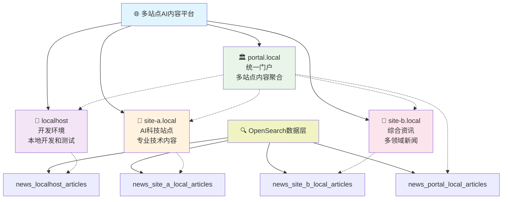

让我查看一下当前系统中的站点配置，了解这四个站点的具体情况和它们之间的关系：
```bash
docker exec local-authoring-1 python authoring/manage.py site_config list
```
让我检查配置文件目录来看看具体有哪些站点：
```bash
ls -la config/sites/
```
现在让我查看站点映射配置来了解这些站点的关系：
Ran tool
现在让我查看这四个站点的具体配置内容：
Ran tool
Ran tool
Ran tool
Ran tool
让我检查OpenSearch中每个站点的数据情况：
```bash
curl -s "http://localhost:9200/_cat/indices/news_*" | sort
```
现在我来解释一下系统中这四个站点的关系和作用：

## 🌐 四个站点的关系架构图


## 📋 四个站点的详细说明

### 1. 🖥️ **localhost** - 开发环境
**作用**: 本地开发和测试环境
- **URL**: `http://localhost:3000`
- **定位**: 开发者工作环境
- **特点**:
  - 启用调试模式和热重载
  - 包含所有开发工具和调试信息
  - 数据隔离，不影响其他站点
  - 作为其他站点的配置模板

### 2. 🏛️ **portal.local** - 统一门户
**作用**: 多站点内容聚合和管理中心
- **URL**: `https://portal.local`
- **定位**: 企业级统一入口
- **特点**:
  - 聚合所有子站点的内容
  - 统一用户认证和权限管理
  - 提供跨站点搜索和推荐
  - 管理员控制中心

### 3. 🤖 **site-a.local** - AI科技站点
**作用**: 专注AI技术的专业垂直站点
- **URL**: `https://site-a.local`
- **定位**: AI技术专业媒体
- **特点**:
  - 专业AI内容和技术文章
  - 启用评论系统和内容审核
  - 高质量的技术讨论社区
  - 专业用户群体

### 4. 📰 **site-b.local** - 综合资讯门户
**作用**: 多领域综合性资讯平台
- **URL**: `https://site-b.local`
- **定位**: 大众化新闻门户
- **特点**:
  - 覆盖科技、财经、体育等多领域
  - 面向大众用户
  - 相对宽松的内容审核
  - 高频更新和多样化内容

## 🔗 站点之间的关系

### 层级关系
```
📱 用户访问层
├── 🏛️ portal.local (统一门户) ← 聚合入口
│   ├── 🤖 site-a.local (AI科技) ← 垂直专业
│   ├── 📰 site-b.local (综合资讯) ← 大众门户
│   └── 🖥️ localhost (开发环境) ← 开发测试
```

### 数据隔离策略
每个站点都有独立的：
- **OpenSearch索引**: `news_{site}_articles_v1`
- **配置文件**: `{site}.yaml`
- **用户数据**: 按站点ID分组
- **缓存空间**: 独立的缓存key空间

### 功能差异化

| 功能 | localhost | portal.local | site-a.local | site-b.local |
|------|-----------|--------------|--------------|--------------|
| **目标用户** | 开发者 | 企业用户 | AI专业人士 | 大众用户 |
| **内容类型** | 测试数据 | 聚合内容 | AI技术 | 综合资讯 |
| **评论系统** | ❌ | ❌ | ✅ | ✅ |
| **内容审核** | ❌ | ❌ | ✅ | ❌ |
| **用户注册** | ✅ | ❌ (统一认证) | ✅ | ✅ |
| **社交登录** | ❌ | ✅ | ✅ | ✅ |
| **调试模式** | ✅ | ❌ | ❌ | ❌ |

## 🎯 设计理念

### 1. **微服务架构**
每个站点作为独立的服务单元，可以：
- 独立扩容和部署
- 个性化配置和优化
- 故障隔离和恢复

### 2. **数据隔离**
通过技术手段确保：
- 数据安全和隐私保护
- 性能优化和查询效率
- 合规性和审计需求

### 3. **统一管理**
在保持独立性的同时：
- 统一的配置管理系统
- 共享的技术栈和组件
- 一致的监控和运维

## 🚀 使用场景

### 开发场景
```bash
# 在localhost进行开发和测试
http://localhost:3000
```

### 企业用户场景
```bash
# 通过portal.local访问所有内容
https://portal.local
```

### 专业用户场景
```bash
# AI从业者访问专业内容
https://site-a.local
```

### 大众用户场景
```bash
# 普通用户获取综合资讯
https://site-b.local
```

这种多站点架构设计实现了：
- **🎯 精准定位**: 每个站点服务特定用户群体
- **🔧 灵活配置**: 根据需求个性化设置
- **📈 可扩展性**: 轻松添加新站点
- **🛡️ 安全隔离**: 数据和功能完全隔离
- **🎨 差异化体验**: 针对不同用户群体优化界面和功能

这就是为什么有四个站点的原因 - 它们共同构成了一个完整的多站点AI内容管理和推荐生态系统！