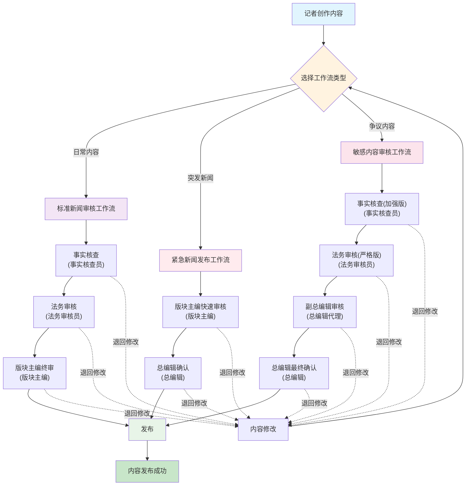

# Wagtail 工作流系统使用指南

## 📰 概述

本指南详细介绍了基于 Wagtail 7.1 构建的专业新闻网站工作流审核系统。该系统利用 Wagtail 内置的工作流功能，实现了严谨的内容审核流程，确保新闻内容的质量、合规性和发布安全。




## 🔄 工作流类型

### 1. 标准新闻审核工作流
**适用场景**: 日常新闻内容、常规资讯文章

**审核流程**:
```
创建内容 → 事实核查 → 法务审核 → 版块主编终审 → 发布
```

**审核环节详情**:
1. **事实核查** (事实核查员)
   - 验证信息来源的真实性和准确性
   - 核查数据、引用和统计信息
   - 确认人物、地点、时间等关键信息

2. **法务审核** (法务审核员)
   - 评估内容的法律风险
   - 检查是否涉及诽谤、侵权等问题
   - 确保符合相关法律法规

3. **版块主编终审** (版块主编)
   - AI科技版块主编：负责AI相关内容
   - 综合资讯版块主编：负责综合资讯内容
   - 门户聚合主编：负责门户聚合内容
   - 最终编辑决策和发布批准

### 2. 紧急新闻发布工作流
**适用场景**: 突发新闻、时效性要求极高的内容

**审核流程**:
```
创建内容 → 版块主编快速审核 → 总编辑确认 → 立即发布
```

**审核环节详情**:
1. **版块主编快速审核** (版块主编)
   - 快速评估内容质量和准确性
   - 确认新闻价值和时效性
   - 进行必要的编辑修改

2. **总编辑确认** (总编辑)
   - 最高级别的内容确认
   - 评估发布风险和影响
   - 最终发布决策

**注意事项**:
- 发布后必须进行完整的事后审核
- 如发现问题需及时修正或撤稿
- 仅限真正紧急的新闻事件使用

### 3. 敏感内容审核工作流
**适用场景**: 涉及法律争议、政策敏感、可能引起争议的内容

**审核流程**:
```
创建内容 → 事实核查(加强版) → 法务审核(严格版) → 副总编辑审核 → 总编辑最终确认 → 发布
```

**审核环节详情**:
1. **事实核查（加强版）** (事实核查员)
   - 深度核查所有信息来源
   - 多渠道验证关键信息
   - 详细记录核查过程和结果

2. **法务审核（严格版）** (法务审核员)
   - 严格评估法律风险
   - 逐句检查可能的法律问题
   - 提供详细的法律意见

3. **副总编辑审核** (总编辑代理)
   - 高级编辑层面的内容审核
   - 评估内容的社会影响
   - 确认发布的必要性和时机

4. **总编辑最终确认** (总编辑)
   - 最高级别的风险评估
   - 最终发布决策
   - 承担最终责任

## 🎯 使用操作指南

### 编辑人员操作

#### 1. 选择工作流
1. 登录 Wagtail 管理界面: http://localhost:8000/admin/
2. 创建或编辑页面
3. 在页面编辑界面右侧的"设置"标签中选择合适的工作流:
   - 标准新闻审核工作流 (常规内容)
   - 紧急新闻发布工作流 (突发新闻)
   - 敏感内容审核工作流 (敏感内容)

#### 2. 提交审核
1. 完成内容创作
2. 保存页面
3. 点击"提交审核"按钮
4. 系统自动将内容发送给第一个审核环节

#### 3. 修改响应
1. 如果审核被退回，会收到通知
2. 根据审核意见进行修改
3. 重新提交审核

### 审核人员操作

#### 1. 查看待审核任务
1. 登录 Wagtail 管理界面
2. 在首页或者导航栏中找到"工作流"面板
3. 查看分配给自己的待审核任务列表

#### 2. 执行审核
1. 点击待审核的内容标题
2. 仔细review内容
3. 选择审核结果:
   - **批准**: 内容通过当前审核环节，进入下一环节
   - **需要修改**: 退回给编辑进行修改
   - **拒绝**: 拒绝发布该内容

#### 3. 添加审核意见
1. 在审核界面的备注栏中添加详细的审核意见
2. 说明批准理由或修改建议
3. 提供具体的改进方向

### 管理员操作

#### 1. 工作流管理
1. 进入"设置" → "工作流"
2. 查看和管理现有工作流
3. 可以停用/启用工作流
4. 查看工作流统计信息

#### 2. 任务监控
1. 监控各审核环节的处理时效
2. 查看积压的审核任务
3. 协调解决审核瓶颈

## 📊 工作流状态说明

### 内容状态
- **草稿**: 内容正在创作中，未提交审核
- **审核中**: 内容已提交，正在某个审核环节
- **需要修改**: 审核退回，需要编辑修改
- **已发布**: 完成所有审核环节，正式发布
- **已拒绝**: 内容被拒绝发布

### 任务状态
- **待处理**: 等待审核人员处理
- **进行中**: 审核人员正在处理
- **已完成**: 审核环节已完成
- **已跳过**: 审核环节被跳过（管理员操作）

## ⚙️ 系统配置

### 已配置的用户组权限

| 审核环节 | 用户组 | 权限说明 |
|---------|-------|----------|
| 事实核查 | 事实核查员 | 负责信息真实性验证 |
| 法务审核 | 法务审核员 | 负责法律风险评估 |
| 版块主编终审 | AI科技版块主编<br>综合资讯版块主编<br>门户聚合主编 | 负责对应版块内容的最终审批 |
| 总编辑确认 | 总编辑 | 负责重要内容的最终决策 |

### 工作流分配规则

1. **内容类型自动分配**: 系统根据内容所属站点自动建议工作流
2. **编辑手动选择**: 编辑可根据内容特性手动选择合适的工作流
3. **管理员强制指定**: 管理员可为特定内容强制指定工作流

## 🔧 高级功能

### 1. 工作流跳转
- 管理员可以跳过某些审核环节
- 适用于紧急情况或特殊内容
- 需要记录跳转理由

### 2. 审核回退
- 可以将内容回退到之前的审核环节
- 适用于发现重大问题需要重新审核的情况
- 保留完整的审核历史记录

### 3. 批量操作
- 支持批量提交审核
- 支持批量审核通过（相同审核人员）
- 提高处理效率

### 4. 审核历史
- 完整记录每个审核环节的处理情况
- 包括审核人员、处理时间、审核意见
- 支持审核过程的追溯和分析

## 📈 性能监控

### 关键指标

1. **审核时效**:
   - 平均审核时间
   - 各环节处理时间分布
   - 超时审核任务统计

2. **审核质量**:
   - 通过率统计
   - 退回率分析
   - 拒绝率监控

3. **工作负载**:
   - 各审核人员的任务分布
   - 审核任务积压情况
   - 工作流使用频率

### 优化建议

1. **流程优化**:
   - 根据统计数据优化审核流程
   - 调整审核环节的先后顺序
   - 合并或拆分审核步骤

2. **人员配置**:
   - 根据工作负载调整审核人员
   - 培训新的审核人员
   - 设置审核人员轮班制度

3. **规则改进**:
   - 优化工作流选择规则
   - 改进自动分配逻辑
   - 制定更明确的审核标准

## 🚨 应急处理

### 紧急撤稿流程
1. 发现已发布内容存在重大问题
2. 立即联系总编辑
3. 使用管理员权限撤回内容
4. 进行紧急修正或删除
5. 记录处理过程和原因

### 系统故障处理
1. 工作流系统故障时的备用流程
2. 通过邮件或其他方式进行人工审核协调
3. 系统恢复后补录审核记录
4. 定期备份工作流配置

## 📚 培训资源

### 新用户培训
1. **编辑人员培训**:
   - 工作流选择原则
   - 内容提交流程
   - 修改响应流程

2. **审核人员培训**:
   - 审核标准和要求
   - 审核操作流程
   - 审核意见撰写

3. **管理人员培训**:
   - 工作流管理
   - 性能监控
   - 应急处理

### 持续改进
- 定期收集用户反馈
- 根据使用情况优化流程
- 更新培训材料和文档
- 分享最佳实践案例

---

**注意**: 本工作流系统与现有的角色权限体系完全集成，确保只有具备相应权限的用户才能执行对应的审核操作。如需调整工作流配置，请联系系统管理员。
