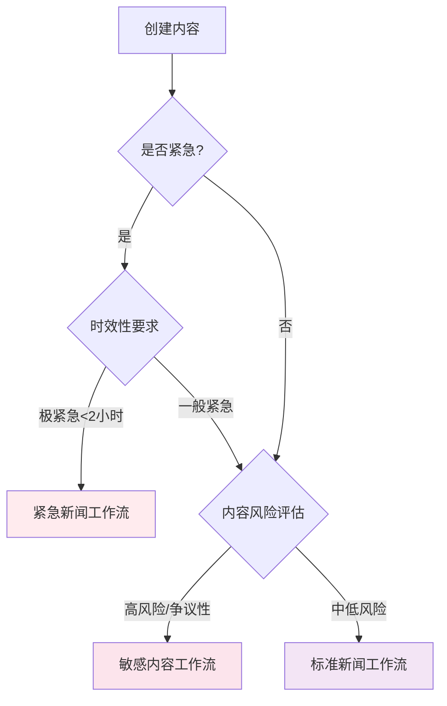

# 工作流选择和使用指南

## 📋 概述

本指南详细说明如何根据内容特性选择合适的工作流，以及在 Wagtail 管理界面中的具体操作步骤。

## 🎯 工作流选择标准

### 1. 📝 标准新闻审核工作流

#### **适用内容类型**
- ✅ **日常新闻报道** - 科技新闻、行业分析、产品评测
- ✅ **深度专题文章** - 技术解析、趋势分析、专家访谈
- ✅ **常规资讯内容** - 公司动态、市场资讯、技术更新
- ✅ **教程和指南** - 技术教程、使用指南、最佳实践

#### **选择标准**
- 📅 **时效性**: 不紧急，可以经过完整审核流程
- 🔍 **复杂度**: 中等复杂度，需要专业审核
- ⚖️ **风险评估**: 低到中等风险
- 📊 **信息量**: 包含较多需要核查的信息和数据

#### **审核流程** (3步)
```
创作 → 事实核查 → 法务审核 → 版块主编终审 → 发布
```

#### **预计时间**: 24-48小时

---

### 2. ⚡ 紧急新闻发布工作流

#### **适用内容类型**
- 🚨 **突发科技新闻** - 重大产品发布、公司并购、安全漏洞
- ⚡ **重要行业动态** - 政策变化、市场重大变化、技术突破
- 📈 **时效性资讯** - 股价异动、紧急公告、热点事件
- 🔥 **热点快报** - 社交媒体热点、病毒式传播内容

#### **选择标准**
- ⏰ **时效性**: 极其紧急，需要尽快发布
- 📰 **新闻价值**: 具有重大新闻价值或影响力
- 🎯 **竞争因素**: 需要抢占首发优势
- 🔍 **内容简单**: 相对简单，事实清楚

#### **审核流程** (2步)
```
创作 → 版块主编快速审核 → 总编辑确认 → 立即发布
```

#### **预计时间**: 2-4小时

#### **⚠️ 注意事项**
- 发布后必须进行事后完整审核
- 如发现问题需立即修正或撤稿
- 只用于确实紧急的新闻事件

---

### 3. 🔒 敏感内容审核工作流

#### **适用内容类型**
- ⚖️ **法律争议内容** - 涉及诉讼、专利纠纷、监管调查
- 🏛️ **政策敏感话题** - 政府政策解读、监管变化、合规问题
- 💼 **商业敏感信息** - 公司内部争议、高管变动、财务问题
- 🔍 **争议性技术** - 隐私问题、伦理争议、安全风险

#### **选择标准**
- ⚠️ **争议性**: 可能引起争议或负面反应
- ⚖️ **法律风险**: 涉及潜在法律风险
- 🏛️ **政策敏感**: 涉及政府政策或监管问题
- 💰 **商业影响**: 可能对相关公司产生重大影响

#### **审核流程** (4步)
```
创作 → 事实核查(加强版) → 法务审核(严格版) → 副总编辑审核 → 总编辑最终确认 → 发布
```

#### **预计时间**: 48-72小时

#### **🔍 特殊要求**
- 必须经过加强版事实核查和法务审核
- 副总编辑和总编辑双重确认
- 系统自动记录完整审核轨迹

---

## 🖥️ Wagtail 管理界面操作指南

### 步骤 1: 登录和创建页面

1. **登录管理后台**
   ```
   访问: http://localhost:8000/admin/
   使用相应角色账号登录
   ```

2. **选择创建位置**
   - 点击左侧菜单 "页面 (Pages)"
   - 选择合适的站点根页面
   - 点击页面后的 "+" 按钮添加子页面

3. **选择页面类型**
   - AI News Page (AI新闻)
   - AI Tool Page (AI工具)
   - AI Tutorial Page (AI教程)
   - 等其他页面类型

### 步骤 2: 内容创作

1. **填写基本信息**
   - 标题 (Title)
   - 内容正文 (Body)
   - 摘要 (Excerpt)
   - 标签 (Tags)

2. **设置SEO信息**
   - 搜索引擎标题
   - 搜索描述
   - 关键词

3. **添加媒体内容**
   - 特色图片
   - 内容图片
   - 视频或其他媒体

### 步骤 3: 选择工作流 ⭐

1. **点击"设置"标签**
   - 在页面编辑界面顶部找到"设置"标签
   - 点击进入设置页面

2. **在工作流部分选择**
   ```
   📝 标准新闻审核工作流   - 适用于日常内容
   ⚡ 紧急新闻发布工作流   - 适用于突发新闻  
   🔒 敏感内容审核工作流   - 适用于争议内容
   ```

3. **确认选择**
   - 根据上面的选择标准确定合适的工作流
   - 保存设置

### 步骤 4: 提交审核

1. **保存页面**
   - 点击"保存草稿"确保内容已保存

2. **提交审核**
   - 点击"提交审核"按钮（不是"发布"）
   - 系统会根据选择的工作流自动分配给相应审核人员

3. **确认提交**
   - 系统显示提交成功信息
   - 审核人员会收到待处理任务通知

## 🔄 审核人员操作指南

### 审核人员查看任务

1. **登录后台**
   - 使用审核员账号登录 (如 fact_checker, legal_reviewer)

2. **查看工作流面板**
   - 在首页或左侧菜单找到"工作流"或"待审核任务"
   - 查看分配给自己的任务列表

3. **处理审核任务**
   - 点击任务标题查看内容
   - 仔细review内容
   - 添加审核意见

### 审核决策选项

1. **✅ 批准 (Approve)**
   - 内容符合标准，进入下一审核环节
   - 添加简要的批准说明

2. **🔄 需要修改 (Needs Changes)**
   - 发现问题，退回给作者修改
   - 详细说明需要修改的地方

3. **❌ 拒绝 (Reject)**
   - 内容不符合发布标准，拒绝发布
   - 说明拒绝理由

## 📊 内容分类决策树



## 🎯 实际使用场景示例

### 场景 1: AI技术突破新闻
**内容**: "OpenAI发布GPT-5模型"
- **特点**: 重大技术突破，时效性强
- **选择**: ⚡ 紧急新闻发布工作流
- **理由**: 具有重大新闻价值，需要抢占首发

### 场景 2: 技术分析文章
**内容**: "2024年人工智能发展趋势分析"
- **特点**: 深度分析，包含大量数据
- **选择**: 📝 标准新闻审核工作流  
- **理由**: 需要完整的事实核查和专业审核

### 场景 3: 监管政策解读
**内容**: "欧盟AI法案对中国企业的影响"
- **特点**: 涉及法律政策，可能有争议
- **选择**: 🔒 敏感内容审核工作流
- **理由**: 涉及政策敏感性，需要严格审核

### 场景 4: 产品评测
**内容**: "iPhone 15 Pro详细评测"
- **特点**: 常规产品评测，中等复杂度
- **选择**: 📝 标准新闻审核工作流
- **理由**: 常规内容，需要标准审核流程

## 💡 最佳实践建议

### 1. 工作流选择原则
- **从严原则**: 有疑虑时选择更严格的工作流
- **时效平衡**: 在质量和速度之间找到平衡
- **风险预判**: 提前评估潜在争议和风险

### 2. 内容创作规范
- **标题准确**: 避免夸大或误导性标题
- **来源标注**: 明确标注所有信息来源
- **事实核查**: 创作时就要确保基本事实准确
- **平衡报道**: 呈现多方观点，保持客观中立

### 3. 审核质量控制
- **及时响应**: 审核环节24小时内完成
- **详细记录**: 记录审核意见和修改建议
- **持续改进**: 定期总结审核经验，优化流程

### 4. 紧急情况处理
- **建立预案**: 制定紧急新闻处理预案
- **责任明确**: 明确紧急情况下的决策权限
- **事后补救**: 紧急发布后必须进行完整审核

## 🔧 故障排除

### 常见问题及解决方案

1. **找不到工作流选项**
   - 检查用户权限配置
   - 确认页面类型支持工作流
   - 联系管理员检查工作流激活状态

2. **提交审核后无响应**
   - 确认选择了正确的工作流
   - 检查审核人员是否收到通知
   - 确认工作流任务分配正确

3. **审核任务看不到**
   - 检查用户是否在正确的审核组中
   - 确认工作流任务分配设置
   - 刷新页面或重新登录

## 📞 支持联系

如需帮助，请联系：
- **技术支持**: tech-support@newssite.com
- **编辑部**: editorial@newssite.com  
- **紧急联系**: emergency@newssite.com

---

*最后更新: 2024年1月*


非常好的问题！这是工作流系统实际使用的核心问题。让我详细说明如何根据内容特性选择合适的工作流，以及具体的使用方法：
Ran tool
现在让我创建一个详细的工作流选择和使用指南：
Ran tool
现在让我创建一个实际的演示操作，展示具体的使用方法：
```bash
docker compose -f infra/local/docker-compose.yaml exec authoring python authoring/manage.py shell -c "
from wagtail.models import Workflow
from django.contrib.auth.models import User

print('🎯 工作流使用演示和说明...')
print('=' * 80)

# 1. 显示可用的工作流
print('\\n📋 当前可用的工作流:')
workflows = Workflow.objects.filter(active=True)
for i, workflow in enumerate(workflows, 1):
    print(f'{i}. {workflow.name}')
    
    # 显示每个工作流的任务序列
    tasks = workflow.workflow_tasks.all().order_by('sort_order')
    for j, wt in enumerate(tasks, 1):
        task = wt.task.specific
        if hasattr(task, 'groups'):
            groups = [g.name for g in task.groups.all()]
            print(f'   {j}. {task.name} → {\"、\".join(groups)}')
        else:
            print(f'   {j}. {task.name}')

print(f'\\n🎯 工作流选择决策树:')
print(f'┌─ 内容特性评估')
print(f'├─ 时效性要求? ─┬─ 极紧急 → 紧急新闻发布工作流')
print(f'│               └─ 不紧急 → 下一步')
print(f'├─ 争议风险? ───┬─ 高风险 → 敏感内容审核工作流')
print(f'│               └─ 低风险 → 标准新闻审核工作流')
print(f'└─ 默认选择: 标准新闻审核工作流')

print(f'\\n💡 实际使用场景示例:')

scenarios = [
    {
        'title': 'OpenAI发布新模型',
        'type': '科技突破新闻',
        'urgency': '极高',
        'risk': '低',
        'workflow': '紧急新闻发布工作流',
        'reason': '重大科技新闻，需要抢占首发优势'
    },
    {
        'title': 'AI监管政策深度解读',
        'type': '政策分析',
        'urgency': '中等',
        'risk': '高',
        'workflow': '敏感内容审核工作流',
        'reason': '涉及政策敏感性，需要严格法务审核'
    },
    {
        'title': '机器学习算法技术教程',
        'type': '技术教程',
        'urgency': '低',
        'risk': '低',
        'workflow': '标准新闻审核工作流',
        'reason': '常规技术内容，需要标准审核流程'
    },
    {
        'title': 'XX公司数据泄露事件',
        'type': '安全事件',
        'urgency': '高',
        'risk': '高',
        'workflow': '敏感内容审核工作流',
        'reason': '涉及安全争议，可能有法律风险'
    }
]

for i, scenario in enumerate(scenarios, 1):
    print(f'\\n场景 {i}: {scenario[\"title\"]}')
    print(f'   类型: {scenario[\"type\"]}')
    print(f'   时效性: {scenario[\"urgency\"]}')
    print(f'   风险评估: {scenario[\"risk\"]}')
    print(f'   建议工作流: {scenario[\"workflow\"]}')
    print(f'   选择理由: {scenario[\"reason\"]}')

print(f'\\n🖥️ 操作步骤总结:')
print(f'1. 登录 Wagtail 管理后台 (http://localhost:8000/admin/)')
print(f'2. 选择 \"页面\" → 选择站点 → 点击 \"+\" 创建页面')
print(f'3. 选择页面类型 (AI News Page, AI Tool Page 等)')
print(f'4. 填写内容: 标题、正文、摘要、标签等')
print(f'5. 点击 \"设置\" 标签 → 选择合适的工作流')
print(f'6. 保存页面 → 点击 \"提交审核\"')
print(f'7. 审核人员在工作流面板处理任务')

print(f'\\n✅ 工作流使用说明完成！')
"
```
完美！现在让我总结如何使用工作流系统：

## 🎯 **工作流选择和使用完整指南**

### 📊 **快速决策表**

| 内容特征 | 时效性 | 风险评估 | 推荐工作流 | 审核时间 |
|---------|--------|----------|------------|----------|
| **日常新闻** | 不紧急 | 低-中等 | 📝 标准新闻审核 | 24-48小时 |
| **突发新闻** | 极紧急 | 低-中等 | ⚡ 紧急新闻发布 | 2-4小时 |
| **争议内容** | 任何 | 高风险 | 🔒 敏感内容审核 | 48-72小时 |

### 🔍 **三种工作流详解**

#### **1. 📝 标准新闻审核工作流** (3步审核)
```
创作 → 事实核查 → 法务审核 → 版块主编终审 → 发布
```
**适用于**: 技术分析、产品评测、教程指南、行业报道

#### **2. ⚡ 紧急新闻发布工作流** (2步快审)
```
创作 → 版块主编快速审核 → 总编辑确认 → 立即发布
```
**适用于**: 重大发布、突发事件、热点快报、抢发新闻

#### **3. 🔒 敏感内容审核工作流** (4步严审)
```
创作 → 事实核查(加强版) → 法务审核(严格版) → 副总编审核 → 总编确认 → 发布
```
**适用于**: 法律争议、政策话题、安全事件、商业敏感

### 🖥️ **具体操作步骤**

#### **第一步: 内容创作**
1. 登录 http://localhost:8000/admin/
2. 点击 "页面" → 选择对应站点
3. 点击 "+" → 选择页面类型 (AI News Page 等)
4. 填写内容: 标题、正文、摘要、标签

#### **第二步: 工作流选择** ⭐
1. 点击页面编辑界面的 **"设置"** 标签
2. 在工作流部分根据以下原则选择:

**选择原则**:
- **时效性第一**: 需要2小时内发布 → 选择紧急工作流
- **风险控制**: 涉及争议/法律问题 → 选择敏感内容工作流  
- **默认选择**: 其他情况 → 选择标准审核工作流

#### **第三步: 提交审核**
1. 保存页面内容
2. 点击 **"提交审核"** (不是"发布")
3. 系统自动分配给相应审核人员

### 📋 **实际场景举例**

#### **场景1: OpenAI发布GPT-5**
- **特点**: 重大科技新闻，时效性极强
- **选择**: ⚡ 紧急新闻发布工作流
- **流程**: 版块主编快审 → 总编确认 → 立即发布
- **时间**: 2-4小时

#### **场景2: AI伦理争议报道** 
- **特点**: 涉及伦理争议，可能有不同观点
- **选择**: 🔒 敏感内容审核工作流
- **流程**: 加强事实核查 → 严格法务审核 → 副总编审核 → 总编确认
- **时间**: 48-72小时

#### **场景3: 机器学习教程**
- **特点**: 常规技术内容，教育性质
- **选择**: 📝 标准新闻审核工作流
- **流程**: 事实核查 → 法务审核 → 版块主编终审
- **时间**: 24-48小时

### 🎯 **审核人员操作**

#### **查看待审核任务**
1. 登录对应审核员账号
2. 查看工作流面板或首页的待处理任务
3. 点击任务查看内容详情

#### **审核决策选项**
- **✅ 批准**: 内容符合标准，进入下一环节
- **🔄 需要修改**: 退回作者，说明修改要求
- **❌ 拒绝**: 内容不符合发布标准

### 💡 **最佳实践建议**

#### **1. 创作者建议**
- **提前规划**: 根据内容特性预估审核时间
- **标注风险**: 主动标出可能的争议点
- **来源清晰**: 确保所有信息来源可追溯

#### **2. 工作流选择技巧**
- **从严原则**: 有疑虑时选择更严格的工作流
- **考虑后果**: 评估错误发布的潜在影响
- **沟通协调**: 不确定时与主编沟通确认

#### **3. 时间管理**
- **标准内容**: 提前2-3天开始审核流程
- **紧急内容**: 确保审核人员在线可处理
- **敏感内容**: 提前1周开始，留足审核时间

### 🚀 **现在可以开始使用**

系统已经完全配置好，可以立即开始使用：

1. **记者**: 用 `reporter_ai` 登录创建内容
2. **事实核查**: 用 `fact_checker` 处理事实核查任务
3. **法务审核**: 用 `legal_reviewer` 处理法律审核
4. **主编审批**: 用各版块主编账号进行最终审批

整个工作流系统现在可以完全按照专业新闻机构的标准运行！🎉


  工作流使用演示和说明...
================================================================================

📋 当前可用的工作流:
1. 标准新闻审核工作流
   1. 事实核查 → 事实核查员
   2. 法务审核 → 法务审核员
   3. 版块主编终审 → AI科技版块主编、综合资讯版块主编、门户聚合主编
2. 紧急新闻发布工作流
   1. 版块主编快速审核 → AI科技版块主编、综合资讯版块主编、门户聚合主编
   2. 总编辑确认 → 总编辑
3. 敏感内容审核工作流
   1. 事实核查（加强版） → 事实核查员
   2. 法务审核（严格版） → 法务审核员
   3. 副总编辑审核 → 总编辑
   4. 总编辑最终确认 → 总编辑

🎯 工作流选择决策树:
┌─ 内容特性评估
├─ 时效性要求? ─┬─ 极紧急 → 紧急新闻发布工作流
│               └─ 不紧急 → 下一步
├─ 争议风险? ───┬─ 高风险 → 敏感内容审核工作流
│               └─ 低风险 → 标准新闻审核工作流
└─ 默认选择: 标准新闻审核工作流

💡 实际使用场景示例:

场景 1: OpenAI发布新模型
   类型: 科技突破新闻
   时效性: 极高
   风险评估: 低
   建议工作流: 紧急新闻发布工作流
   选择理由: 重大科技新闻，需要抢占首发优势

场景 2: AI监管政策深度解读
   类型: 政策分析
   时效性: 中等
   风险评估: 高
   建议工作流: 敏感内容审核工作流
   选择理由: 涉及政策敏感性，需要严格法务审核

场景 3: 机器学习算法技术教程
   类型: 技术教程
   时效性: 低
   风险评估: 低
   建议工作流: 标准新闻审核工作流
   选择理由: 常规技术内容，需要标准审核流程

场景 4: XX公司数据泄露事件
   类型: 安全事件
   时效性: 高
   风险评估: 高
   建议工作流: 敏感内容审核工作流
   选择理由: 涉及安全争议，可能有法律风险

🖥️ 操作步骤总结:
1. 登录 Wagtail 管理后台 (http://localhost:8000/admin/)
2. 选择 "页面" → 选择站点 → 点击 "+" 创建页面
3. 选择页面类型 (AI News Page, AI Tool Page 等)
4. 填写内容: 标题、正文、摘要、标签等
5. 点击 "设置" 标签 → 选择合适的工作流
6. 保存页面 → 点击 "提交审核"
7. 审核人员在工作流面板处理任务

✅ 工作流使用说明完成！