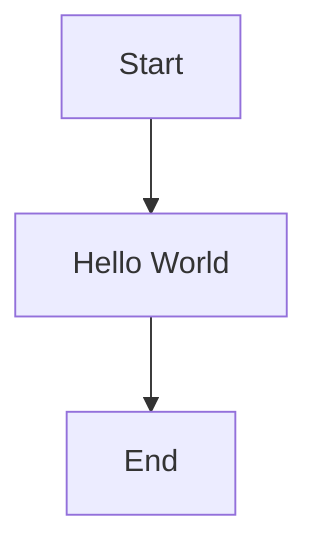

# AI 辅助开发

## 1. 代码生成




```
// 生成一个简单的 Hello World 程序
```python
print("Hello, World!")
```

1. 生成一个简单的 Hello World 程序

```python
print("Hello, World!")
```

2. 生成一个简单的 Hello World 程

// 生成一个简单的 Hello World 程序

// 生成一个简单的 Hello World 程序

// 生成一个简单的 Hello World 程序

```

## 2. 代码补全

## 3. 代码解释

## 4. 代码优化

## 5. 代码重构